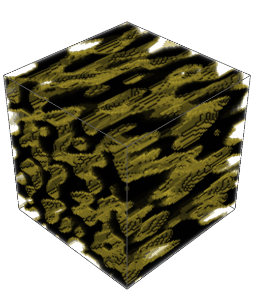
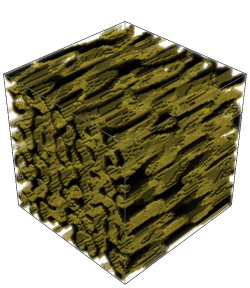
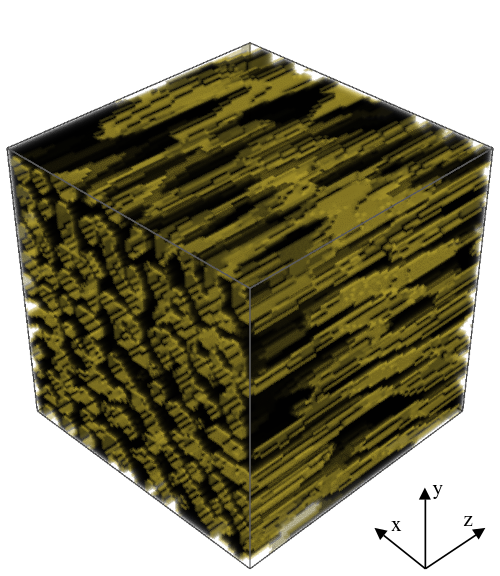
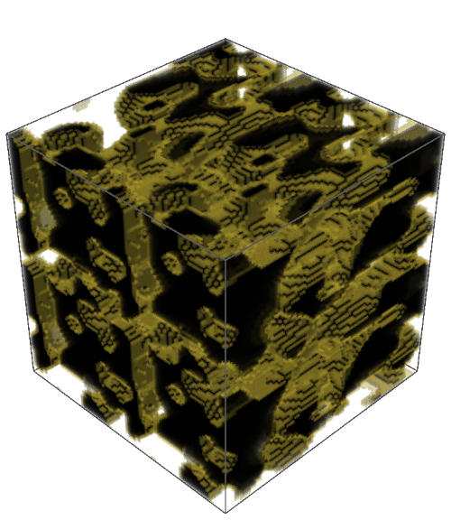
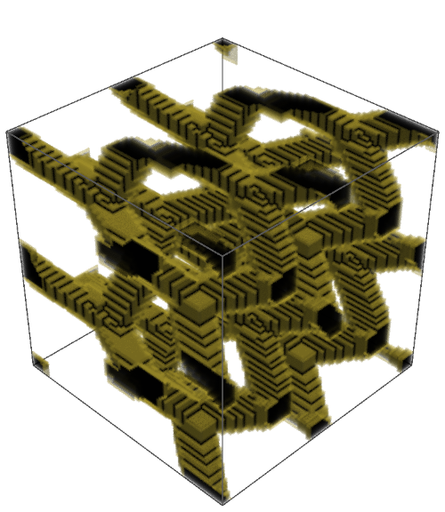
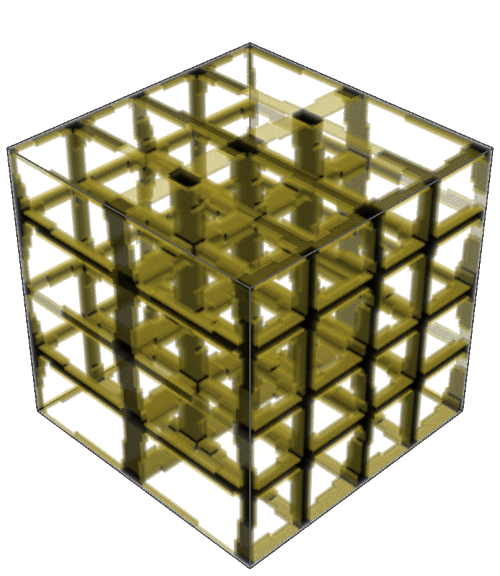
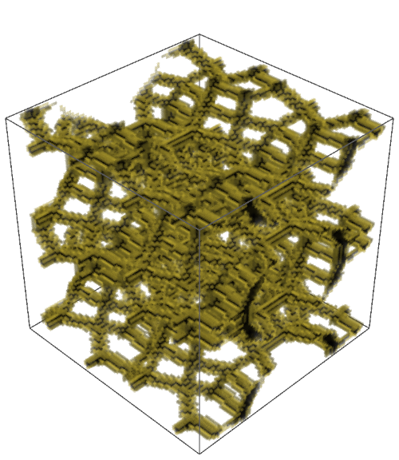
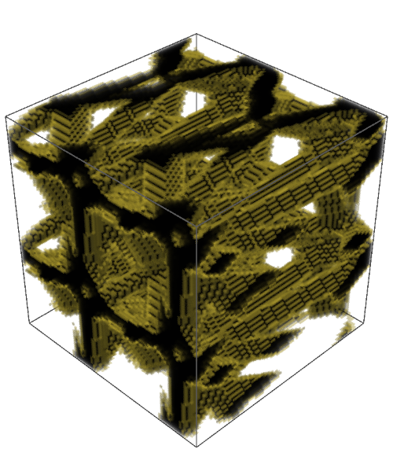

# Dataset

```{admonition} Coverage
:class: important
This page annotates **Main manuscript**, source lines **67-313**. The original LaTeX source is reproduced in line-numbered blocks, followed by commentary explaining the role, assumptions, and interpretation of each block.
```

## Reading Lens

- This is the experimental design section. It defines where the geometry comes from, how anisotropy is controlled, and how mechanical targets are computed.
- The dataset choices are not incidental: RTP isolates controlled anisotropy, TD tests generalization under statistical isotropy, and ATTD tests a transformed anisotropic setting.
- Every later performance claim depends on the target-generation and anisotropy definitions introduced here.

## Annotated Source

### Dataset

::::{admonition} Source lines 67-67
:class: note

```latex
  67 | \section{Dataset}
```

**Readable text**

> Dataset

**Commentary and remarks**

- This heading opens a new logical unit: **Dataset**.
- Use it as a checkpoint: the paper is changing either scale, object, method, or evidential role.
- In the dataset section, this block defines the experimental material on which all later descriptor comparisons depend.
::::

#### Random Trigonometric Phase

::::{admonition} Source lines 69-69
:class: note

```latex
  69 | \subsection{Random Trigonometric Phase}
```

**Readable text**

> Random Trigonometric Phase

**Commentary and remarks**

- This heading opens a new logical unit: **Random Trigonometric Phase**.
- Use it as a checkpoint: the paper is changing either scale, object, method, or evidential role.
- This defines the RTP construction, where anisotropy is controlled in Fourier space before thresholding into a porous structure.
- In the dataset section, this block defines the experimental material on which all later descriptor comparisons depend.
::::

::::{admonition} Source lines 71-74
:class: note

```latex
  71 | The porous two-phase structures used in this study were generated using a
  72 | \emph{random trigonometric phase} (RTP) approach, in which a continuous,
  73 | statistically homogeneous random field is constructed as a superposition of
  74 | trigonometric modes with random phases and wavevectors.
```

**Readable text**

> The porous two-phase structures used in this study were generated using a random trigonometric phase (RTP) approach, in which a continuous, statistically homogeneous random field is constructed as a superposition of trigonometric modes with random phases and wavevectors.

**Commentary and remarks**

- This keeps the physical object in view: porous solid/void geometry is the structure whose topology and mechanics are being related.
- This defines the RTP construction, where anisotropy is controlled in Fourier space before thresholding into a porous structure.
- In the dataset section, this block defines the experimental material on which all later descriptor comparisons depend.
::::

::::{admonition} Source lines 77-82
:class: note

```latex
  77 | We consider a cubic domain discretized on a regular
  78 | $N \times N \times N$ grid with $N=80$ and periodic boundary conditions.
  79 | The spatial coordinates are normalized to the unit cube,
  80 | $\mathbf{x} \in [0,1)^3$, and periodicity is enforced implicitly by the
  81 | trigonometric basis.
  82 | The RTP scalar field $S(\mathbf{x})$ is defined as
```

**Readable text**

> We consider a cubic domain discretized on a regular $N x N x N$ grid with $N=80$ and periodic boundary conditions. The spatial coordinates are normalized to the unit cube, $x in [0,1)^3$, and periodicity is enforced implicitly by the trigonometric basis. The RTP scalar field $S(x)$ is defined as

**Commentary and remarks**

- This defines the RTP construction, where anisotropy is controlled in Fourier space before thresholding into a porous structure.
- This broadens the study beyond RTP by adding structurally diverse families that test whether the descriptor idea generalizes.
- In the dataset section, this block defines the experimental material on which all later descriptor comparisons depend.
::::

::::{admonition} Source lines 83-89
:class: note

```latex
  83 | \begin{equation}
  84 | \label{eqn:rtp_S}
  85 | S(\mathbf{x}) =
  86 | \sqrt{\frac{2}{K}}
  87 | \sum_{k=1}^{K}
  88 | \cos\!\left( 2\pi\,\mathbf{q}_k \cdot \mathbf{x} + \phi_k \right),
  89 | \end{equation}
```

**Commentary and remarks**

- This mathematical block defines part of the computational object used later in the pipeline.
- Track the variables here: later descriptors and model inputs inherit these definitions.
- This defines the RTP construction, where anisotropy is controlled in Fourier space before thresholding into a porous structure.
- In the dataset section, this block defines the experimental material on which all later descriptor comparisons depend.
::::

::::{admonition} Source lines 90-94
:class: note

```latex
  90 | where $K$ is the number of trigonometric modes,
  91 | $\phi_k \sim \mathcal{U}(0,2\pi)$ are independent random phase shifts, and the
  92 | wavevectors $\mathbf{q}_k$ are sampled from a bounded integer lattice $\mathbf{q}_k = (n_x, n_y, n_z), n_\alpha \in [-n_\text{max}, n_\text{max}].$
  93 | Because each cosine mode is periodic on the unit torus, the field $S$ and all
  94 | derived microstructures satisfy periodic boundary conditions by construction.
```

**Readable text**

> where $K$ is the number of trigonometric modes, $phi_k ~ U(0,2pi)$ are independent random phase shifts, and the wavevectors $q_k$ are sampled from a bounded integer lattice $q_k = (n_x, n_y, n_z), n_alpha in [-n_max, n_max].$ Because each cosine mode is periodic on the unit torus, the field $S$ and all derived microstructures satisfy periodic boundary conditions by construction.

**Commentary and remarks**

- This keeps the physical object in view: porous solid/void geometry is the structure whose topology and mechanics are being related.
- This defines the RTP construction, where anisotropy is controlled in Fourier space before thresholding into a porous structure.
- In the dataset section, this block defines the experimental material on which all later descriptor comparisons depend.
::::

::::{admonition} Source lines 96-98
:class: note

```latex
  96 | The continuous field $S(\mathbf{x})$ is converted into a binary porous medium
  97 | by thresholding.
  98 | The material indicator function $X(\mathbf{x}) \in \{0,1\}$ is defined as
```

**Readable text**

> The continuous field $S(x)$ is converted into a binary porous medium by thresholding. The material indicator function $X(x) in \0,1\$ is defined as

**Commentary and remarks**

- This keeps the physical object in view: porous solid/void geometry is the structure whose topology and mechanics are being related.
- This explains how continuous fields become admissible binary materials and why connectivity/percolation filters are needed for mechanical tests.
- In the dataset section, this block defines the experimental material on which all later descriptor comparisons depend.
::::

::::{admonition} Source lines 99-105
:class: note

```latex
  99 | \[
 100 | X(\mathbf{x}) =
 101 | \begin{cases}
 102 | 1, & S(\mathbf{x}) > \tau, \\
 103 | 0, & \text{otherwise},
 104 | \end{cases}
 105 | \]
```

**Commentary and remarks**

- This mathematical block defines part of the computational object used later in the pipeline.
- Track the variables here: later descriptors and model inputs inherit these definitions.
- In the dataset section, this block defines the experimental material on which all later descriptor comparisons depend.
::::

::::{admonition} Source lines 106-114
:class: note

```latex
 106 | where $X=1$ denotes solid material and $X=0$ denotes void.
 107 | For each realization, the threshold $\tau$ is determined numerically such that
 108 | the resulting porosity $\phi$ matches a prescribed target value, selected
 109 | prior to generation.
 110 | To ensure physically meaningful structures, each realization is subjected to a
 111 | connectivity and percolation analysis under periodic boundary conditions:
 112 | all material voxels must form a single connected component and the solid phase
 113 | must percolate across the domain in all three Cartesian directions, otherwise the structure is not included in the dataset.
 114 | In this study, we used $K$ values sampled uniformly from the interval $[10, 30]$, fixed $n_{\text{max}} = 12$, and selected the target porosity uniformly from the interval $[0.2, 0.8]$.
```

**Readable text**

> where $X=1$ denotes solid material and $X=0$ denotes void. For each realization, the threshold $tau$ is determined numerically such that the resulting porosity $phi$ matches a prescribed target value, selected prior to generation. To ensure physically meaningful structures, each realization is subjected to a connectivity and percolation analysis under periodic boundary conditions: all material voxels must form a single connected component and the solid phase must percolate across the domain in all three Cartesian directions, otherwise the structure is not included in the dataset. In this study, we used $K$ values sampled uniformly from the interval $[10, 30]$, fixed $n_max = 12$, and selected the target porosity uniformly from the interval $[0.2, 0.8]$.

**Commentary and remarks**

- This keeps the physical object in view: porous solid/void geometry is the structure whose topology and mechanics are being related.
- This is the density-baseline motivation: porosity alone is treated as insufficient for predicting stiffness across complex porous morphologies.
- This is central to the paper: the loading direction must survive the descriptor construction because the material response is axis-dependent.
- This defines the RTP construction, where anisotropy is controlled in Fourier space before thresholding into a porous structure.
- This explains how continuous fields become admissible binary materials and why connectivity/percolation filters are needed for mechanical tests.
::::

::::{admonition} Source lines 117-123
:class: note

```latex
 117 | In the isotropic case, the statistical properties of $S$ are invariant under
 118 | rotations, as the spectral content is identical on average along all spatial
 119 | directions.
 120 | Directional anisotropy is introduced explicitly in Fourier space by scaling
 121 | the components of the wavevectors prior to evaluating Eq.~\eqref{eqn:rtp_S}.
 122 | Specifically, integer wavevectors $\mathbf{q}_k^{(0)}$ are first sampled
 123 | uniformly from the bounded lattice, and the final wavevectors are defined as
```

**Readable text**

> In the isotropic case, the statistical properties of $S$ are invariant under rotations, as the spectral content is identical on average along all spatial directions. Directional anisotropy is introduced explicitly in Fourier space by scaling the components of the wavevectors prior to evaluating Eq.~eqn:rtp_S. Specifically, integer wavevectors $q_k^(0)$ are first sampled uniformly from the bounded lattice, and the final wavevectors are defined as

**Commentary and remarks**

- This is central to the paper: the loading direction must survive the descriptor construction because the material response is axis-dependent.
- This defines the RTP construction, where anisotropy is controlled in Fourier space before thresholding into a porous structure.
- This supplies the scalar anisotropy summaries used to interpret when directional descriptors should matter most.
- This is the target-generation mechanism: the paper uses FFT-based homogenization rather than treating stiffness labels as empirical annotations.
- In the dataset section, this block defines the experimental material on which all later descriptor comparisons depend.
::::

::::{admonition} Source lines 124-126
:class: note

```latex
 124 | \begin{equation*}
 125 | \mathbf{q}_k = \mathrm{diag}(s_x, s_y, s_z)\,\mathbf{q}_k^{(0)},
 126 | \end{equation*}
```

**Commentary and remarks**

- This mathematical block defines part of the computational object used later in the pipeline.
- Track the variables here: later descriptors and model inputs inherit these definitions.
- In the dataset section, this block defines the experimental material on which all later descriptor comparisons depend.
::::

::::{admonition} Source lines 127-131
:class: note

```latex
 127 | where $(s_x, s_y, s_z)$ are prescribed anisotropy scaling factors.
 128 | This construction directly controls the characteristic correlation lengths of
 129 | the random field: larger values of $s_\alpha$ correspond to higher spatial
 130 | frequencies and thus shorter correlation lengths along direction $\alpha$,
 131 | whereas smaller values of $s_\alpha$ lead to longer-range correlations.
```

**Readable text**

> where $(s_x, s_y, s_z)$ are prescribed anisotropy scaling factors. This construction directly controls the characteristic correlation lengths of the random field: larger values of $s_alpha$ correspond to higher spatial frequencies and thus shorter correlation lengths along direction $alpha$, whereas smaller values of $s_alpha$ lead to longer-range correlations.

**Commentary and remarks**

- This is central to the paper: the loading direction must survive the descriptor construction because the material response is axis-dependent.
- In the dataset section, this block defines the experimental material on which all later descriptor comparisons depend.
::::

::::{admonition} Source lines 133-135
:class: note

```latex
 133 | In this work, we set $s_x = s_y = 1$ and $s_z = 0.2$, resulting in structures
 134 | with significantly extended correlation length along the $z$ axis and a
 135 | pronounced directional anisotropy.
```

**Readable text**

> In this work, we set $s_x = s_y = 1$ and $s_z = 0.2$, resulting in structures with significantly extended correlation length along the $z$ axis and a pronounced directional anisotropy.

**Commentary and remarks**

- This is central to the paper: the loading direction must survive the descriptor construction because the material response is axis-dependent.
- In the dataset section, this block defines the experimental material on which all later descriptor comparisons depend.
::::

::::{admonition} Source lines 137-152
:class: note

```latex
 137 | \begin{figure}
 138 |     \centering
 139 |     \begin{overpic}[width=0.3\textwidth]{render_rtp_420.png}
 140 |         \put(5,85){\large a}
 141 |     \end{overpic}
 142 |     \begin{overpic}[width=0.3\textwidth]{render_rtp_121.png}
 143 |         \put(5,85){\large b}
 144 |     \end{overpic}
 145 |     \begin{overpic}[width=0.3\textwidth]{render_rtp_349.png}
 146 |         \put(5,85){\large c}
 147 |     \end{overpic}
 148 |     \caption{
 149 |     Three exemplary RTP structures illustrating increasing structural and mechanical anisotropy. The directional Young’s moduli $E=(E_x,E_y,E_z)$ are: (a) $(10.3, 11.3, 31.4)\,\mathrm{GPa}$, (b) $(5.2, 10.0, 33.1)\,\mathrm{GPa}$, and (c) $(19.8, 17.5, 51.2)\,\mathrm{GPa}$. The corresponding porosities are $0.60$, $0.54$, and $0.68$, while the spectral anisotropy components $k=(k_x,k_y,k_z)$ are $(0.63, 0.69, 0.27)$, $(0.98, 0.89, 0.25)$, and $(1.00, 1.20, 0.19)$, respectively. The progressive reduction of $k_z$ relative to $k_x$ and $k_y$ reflects increasing elongation along the $z$ direction, consistent with the growing contrast between in-plane and out-of-plane Young’s moduli.
 150 |         }
 151 |     \label{fig:rtp}
 152 | \end{figure}
```

**Readable text**

> Three exemplary RTP structures illustrating increasing structural and mechanical anisotropy. The directional Young’s moduli $E=(E_x,E_y,E_z)$ are: (a) $(10.3, 11.3, 31.4) GPa$, (b) $(5.2, 10.0, 33.1) GPa$, and (c) $(19.8, 17.5, 51.2) GPa$. The corresponding porosities are $0.60$, $0.54$, and $0.68$, while the spectral anisotropy components $k=(k_x,k_y,k_z)$ are $(0.63, 0.69, 0.27)$, $(0.98, 0.89, 0.25)$, and $(1.00, 1.20, 0.19)$, respectively. The progressive reduction of $k_z$ relative to $k_x$ and $k_y$ reflects increasing elongation along the $z$ direction, consistent with the growing contrast between in-plane and out-of-plane Young’s moduli.

**Figure assets carried into the book**







**Commentary and remarks**

- This figure is evidential, not decorative: it gives visual grounding for the structures, descriptors, or performance pattern discussed around it.
- Read the caption carefully because it usually encodes the variables and comparisons that make the visual scientifically meaningful.
- This connects geometry to the target variable: directional Young's modulus under a specified loading axis.
- This is central to the paper: the loading direction must survive the descriptor construction because the material response is axis-dependent.
- This defines the RTP construction, where anisotropy is controlled in Fourier space before thresholding into a porous structure.
::::

::::{admonition} Source lines 154-154
:class: note

```latex
 154 | A total of 500 distinct RTP microstructures were generated. For each structure, uniaxial compression tests were performed independently along the three Cartesian directions, and the corresponding directional Young’s moduli were computed using an FFT-based spectral homogenization method implemented in \texttt{FFTMAD} (see Section~\ref{sec:fftmad} for details of the numerical procedure). Figure~\ref{fig:rtp} presents three exemplary RTP structures spanning increasing levels of structural anisotropy, together with their corresponding directional Young’s moduli, porosities, and spectral anisotropy measures, illustrating correlation between directional morphology and mechanical response.
```

**Readable text**

> A total of 500 distinct RTP microstructures were generated. For each structure, uniaxial compression tests were performed independently along the three Cartesian directions, and the corresponding directional Young’s moduli were computed using an FFT-based spectral homogenization method implemented in `FFTMAD` (see Section (ref: sec:fftmad) for details of the numerical procedure). Figure (ref: fig:rtp) presents three exemplary RTP structures spanning increasing levels of structural anisotropy, together with their corresponding directional Young’s moduli, porosities, and spectral anisotropy measures, illustrating correlation between directional morphology and mechanical response.

**Commentary and remarks**

- This keeps the physical object in view: porous solid/void geometry is the structure whose topology and mechanics are being related.
- This connects geometry to the target variable: directional Young's modulus under a specified loading axis.
- This is central to the paper: the loading direction must survive the descriptor construction because the material response is axis-dependent.
- This defines the RTP construction, where anisotropy is controlled in Fourier space before thresholding into a porous structure.
- This supplies the scalar anisotropy summaries used to interpret when directional descriptors should matter most.
::::

#### Dataset of topologically diverse structures

::::{admonition} Source lines 156-156
:class: note

```latex
 156 | \subsection{Dataset of topologically diverse structures}
```

**Readable text**

> Dataset of topologically diverse structures

**Commentary and remarks**

- This heading opens a new logical unit: **Dataset of topologically diverse structures**.
- Use it as a checkpoint: the paper is changing either scale, object, method, or evidential role.
- This broadens the study beyond RTP by adding structurally diverse families that test whether the descriptor idea generalizes.
- In the dataset section, this block defines the experimental material on which all later descriptor comparisons depend.
::::

::::{admonition} Source lines 157-180
:class: note

```latex
 157 | \label{sec:td_structures}
 158 | A dataset of 2375 topologically diverse (TD) 
 159 | periodic porous structures was generated to assess the
 160 | generality of the proposed topological descriptors beyond RTP-based structures.
 161 | All structures occupy a normalized $1\times1\times1$ cubic domain, voxelized on a
 162 | regular $80\times80\times80$ grid, and satisfy periodic boundary conditions in all three spatial
 163 | directions.
 164 | Importantly, the dataset was constructed to be \emph{statistically isotropic}:
 165 | no preferred spatial direction is imposed by the generation procedures, and the
 166 | resulting ensembles exhibit no systematic directional bias in their geometric
 167 | or mechanical properties.
 168 | Within this constraint, the dataset spans a broad range of pore morphologies and
 169 | topologies.
 170 | The dataset comprises five approximately equally sized subsets, each
 171 | corresponding to a distinct family of porous structures generated by a
 172 | different stochastic algorithm.
 173 | Within each family, randomness ensures substantial variability in geometric
 174 | features and effective elastic properties while preserving statistical
 175 | isotropy. Additional details on the generating algorithms are available in the SI, while the full dataset, together with the corresponding unidirectional Young’s moduli, is available in the dedicated repository associated with this paper -- see section Code and Data Availability for more information.
 176 | The five structure families are referred to as Voronoi, Zeolitic, Diamond-like,
 177 | Cubic-strut, and Spline-based structures.
 178 | Representative examples and generation schematics are shown in
 179 | Figure~\ref{fig:various_aniso}.
 180 | Below we briefly summarize the defining characteristics of each family.
```

**Readable text**

> (label: sec:td_structures) A dataset of 2375 topologically diverse (TD) periodic porous structures was generated to assess the generality of the proposed topological descriptors beyond RTP-based structures. All structures occupy a normalized $1x1x1$ cubic domain, voxelized on a regular $80x80x80$ grid, and satisfy periodic boundary conditions in all three spatial directions. Importantly, the dataset was constructed to be statistically isotropic: no preferred spatial direction is imposed by the generation procedures, and the resulting ensembles exhibit no systematic directional bias in their geometric or mechanical properties. Within this constraint, the dataset spans a broad range of pore morphologies and topologies. The dataset comprises five approximately equally sized subsets, each corresponding to a distinct family of porous structures generated by a different stochastic algorithm. Within each family, randomness ensures substantial variability in geometric features and effective elastic properties while preserving statistical isotropy. Additional details on the generating algorithms are available in the SI, while the full dataset, together with the corresponding unidirectional Young’s moduli, is available in the dedicated repository associated with this paper -- see section Code and Data Availability for more information. The five structure families are referred to as Voronoi, Zeolitic, Diamond-like, Cubic-strut, and Spline-based structures. Representative examples and generation schematics are shown in Figure (ref: fig:various_aniso). Below we briefly summarize the defining characteristics of each family.

**Commentary and remarks**

- This keeps the physical object in view: porous solid/void geometry is the structure whose topology and mechanics are being related.
- This connects geometry to the target variable: directional Young's modulus under a specified loading axis.
- This is central to the paper: the loading direction must survive the descriptor construction because the material response is axis-dependent.
- This defines the RTP construction, where anisotropy is controlled in Fourier space before thresholding into a porous structure.
- This broadens the study beyond RTP by adding structurally diverse families that test whether the descriptor idea generalizes.
::::

##### Voronoi-based structures

::::{admonition} Source lines 182-182
:class: note

```latex
 182 | \paragraph{Voronoi-based structures} were generated from three-dimensional Voronoi
```

**Readable text**

> Voronoi-based structures were generated from three-dimensional Voronoi

**Commentary and remarks**

- This heading opens a new logical unit: **Voronoi-based structures**.
- Use it as a checkpoint: the paper is changing either scale, object, method, or evidential role.
- This broadens the study beyond RTP by adding structurally diverse families that test whether the descriptor idea generalizes.
- In the dataset section, this block defines the experimental material on which all later descriptor comparisons depend.
::::

::::{admonition} Source lines 183-187
:class: note

```latex
 183 | tessellations of randomly distributed seed points within the unit cell.
 184 | Between three and twelve points were sampled uniformly per realization, and the
 185 | edges of the resulting tessellation were used as the structural skeleton.
 186 | These edges were voxelized and thickened to form struts with square cross
 187 | sections of randomly varying thickness (see Figure~S1 in the Supplementary Information).
```

**Readable text**

> tessellations of randomly distributed seed points within the unit cell. Between three and twelve points were sampled uniformly per realization, and the edges of the resulting tessellation were used as the structural skeleton. These edges were voxelized and thickened to form struts with square cross sections of randomly varying thickness (see Figure~S1 in the Supplementary Information).

**Commentary and remarks**

- This keeps the physical object in view: porous solid/void geometry is the structure whose topology and mechanics are being related.
- In the dataset section, this block defines the experimental material on which all later descriptor comparisons depend.
::::

##### Zeolitic-inspired structures

::::{admonition} Source lines 189-189
:class: note

```latex
 189 | \paragraph{Zeolitic-inspired structures} were derived from predicted zeolite frameworks reported in
```

**Readable text**

> Zeolitic-inspired structures were derived from predicted zeolite frameworks reported in

**Commentary and remarks**

- This heading opens a new logical unit: **Zeolitic-inspired structures**.
- Use it as a checkpoint: the paper is changing either scale, object, method, or evidential role.
- This broadens the study beyond RTP by adding structurally diverse families that test whether the descriptor idea generalizes.
- In the dataset section, this block defines the experimental material on which all later descriptor comparisons depend.
::::

::::{admonition} Source lines 190-195
:class: note

```latex
 190 | the database of Deem and co-workers~\cite{C0CP02255A,deem2023pcod}.
 191 | A subset of structures with orthogonal unit cells was selected and rescaled to
 192 | the normalized cubic domain.
 193 | Although individual realizations may exhibit complex internal connectivity, the
 194 | ensemble does not privilege any spatial direction and is therefore
 195 | statistically isotropic.
```

**Readable text**

> the database of Deem and co-workers (citation: C0CP02255A,deem2023pcod). A subset of structures with orthogonal unit cells was selected and rescaled to the normalized cubic domain. Although individual realizations may exhibit complex internal connectivity, the ensemble does not privilege any spatial direction and is therefore statistically isotropic.

**Commentary and remarks**

- This is central to the paper: the loading direction must survive the descriptor construction because the material response is axis-dependent.
- This broadens the study beyond RTP by adding structurally diverse families that test whether the descriptor idea generalizes.
- In the dataset section, this block defines the experimental material on which all later descriptor comparisons depend.
::::

##### Diamond-like structures

::::{admonition} Source lines 197-197
:class: note

```latex
 197 | \paragraph{Diamond-like structures} were generated by perturbing the atomic positions of an
```

**Readable text**

> Diamond-like structures were generated by perturbing the atomic positions of an

**Commentary and remarks**

- This heading opens a new logical unit: **Diamond-like structures**.
- Use it as a checkpoint: the paper is changing either scale, object, method, or evidential role.
- This broadens the study beyond RTP by adding structurally diverse families that test whether the descriptor idea generalizes.
- In the dataset section, this block defines the experimental material on which all later descriptor comparisons depend.
::::

::::{admonition} Source lines 198-204
:class: note

```latex
 198 | ideal diamond lattice within the unit cell.
 199 | Random displacements drawn from isotropic normal distributions were applied
 200 | uniformly to all lattice sites, with the displacement magnitude varied across
 201 | realizations.
 202 | Edges corresponding to nearest-neighbor bonds were then thickened to form struts
 203 | with randomly selected square cross sections, producing networks that remain
 204 | statistically isotropic at the ensemble level.
```

**Readable text**

> ideal diamond lattice within the unit cell. Random displacements drawn from isotropic normal distributions were applied uniformly to all lattice sites, with the displacement magnitude varied across realizations. Edges corresponding to nearest-neighbor bonds were then thickened to form struts with randomly selected square cross sections, producing networks that remain statistically isotropic at the ensemble level.

**Commentary and remarks**

- This broadens the study beyond RTP by adding structurally diverse families that test whether the descriptor idea generalizes.
- In the dataset section, this block defines the experimental material on which all later descriptor comparisons depend.
::::

##### Cubic-strut structures

::::{admonition} Source lines 206-206
:class: note

```latex
 206 | \paragraph{Cubic-strut structures} were generated using the same procedure as for the
```

**Readable text**

> Cubic-strut structures were generated using the same procedure as for the

**Commentary and remarks**

- This heading opens a new logical unit: **Cubic-strut structures**.
- Use it as a checkpoint: the paper is changing either scale, object, method, or evidential role.
- This broadens the study beyond RTP by adding structurally diverse families that test whether the descriptor idea generalizes.
- In the dataset section, this block defines the experimental material on which all later descriptor comparisons depend.
::::

::::{admonition} Source lines 207-211
:class: note

```latex
 207 | diamond-like structures, but starting from a simple cubic lattice rather than a
 208 | diamond lattice.
 209 | Random perturbations of the lattice sites and variations in strut thickness
 210 | introduce geometric disorder while preserving the absence of any preferred
 211 | orientation in the ensemble.
```

**Readable text**

> diamond-like structures, but starting from a simple cubic lattice rather than a diamond lattice. Random perturbations of the lattice sites and variations in strut thickness introduce geometric disorder while preserving the absence of any preferred orientation in the ensemble.

**Commentary and remarks**

- This broadens the study beyond RTP by adding structurally diverse families that test whether the descriptor idea generalizes.
- In the dataset section, this block defines the experimental material on which all later descriptor comparisons depend.
::::

##### Spline-based structures

::::{admonition} Source lines 213-213
:class: note

```latex
 213 | \paragraph{Spline-based structures} were constructed by thresholding smooth, periodic scalar
```

**Readable text**

> Spline-based structures were constructed by thresholding smooth, periodic scalar

**Commentary and remarks**

- This heading opens a new logical unit: **Spline-based structures**.
- Use it as a checkpoint: the paper is changing either scale, object, method, or evidential role.
- This explains how continuous fields become admissible binary materials and why connectivity/percolation filters are needed for mechanical tests.
- This broadens the study beyond RTP by adding structurally diverse families that test whether the descriptor idea generalizes.
- In the dataset section, this block defines the experimental material on which all later descriptor comparisons depend.
::::

::::{admonition} Source lines 214-220
:class: note

```latex
 214 | fields defined via trivariate tensor-product B-splines.
 215 | Random spline coefficients were drawn independently, and periodicity was
 216 | enforced at the level of the spline basis.
 217 | Because the underlying scalar fields are generated without directional
 218 | preference, the resulting binary porous structures form a statistically
 219 | isotropic ensemble with smooth pore morphologies and controlled volume
 220 | fractions.
```

**Readable text**

> fields defined via trivariate tensor-product B-splines. Random spline coefficients were drawn independently, and periodicity was enforced at the level of the spline basis. Because the underlying scalar fields are generated without directional preference, the resulting binary porous structures form a statistically isotropic ensemble with smooth pore morphologies and controlled volume fractions.

**Commentary and remarks**

- This keeps the physical object in view: porous solid/void geometry is the structure whose topology and mechanics are being related.
- This is central to the paper: the loading direction must survive the descriptor construction because the material response is axis-dependent.
- This explains how continuous fields become admissible binary materials and why connectivity/percolation filters are needed for mechanical tests.
- This broadens the study beyond RTP by adding structurally diverse families that test whether the descriptor idea generalizes.
- In the dataset section, this block defines the experimental material on which all later descriptor comparisons depend.
::::

#### Dataset of anisotropic transformed topologically diverse structures

::::{admonition} Source lines 222-222
:class: note

```latex
 222 | \subsection{Dataset of anisotropic transformed topologically diverse structures}
```

**Readable text**

> Dataset of anisotropic transformed topologically diverse structures

**Commentary and remarks**

- This heading opens a new logical unit: **Dataset of anisotropic transformed topologically diverse structures**.
- Use it as a checkpoint: the paper is changing either scale, object, method, or evidential role.
- This is central to the paper: the loading direction must survive the descriptor construction because the material response is axis-dependent.
- This broadens the study beyond RTP by adding structurally diverse families that test whether the descriptor idea generalizes.
- This constructs anisotropy by transforming otherwise diverse structures, giving a bridge between controlled RTP anisotropy and heterogeneous real-looking morphologies.
::::

::::{admonition} Source lines 223-243
:class: note

```latex
 223 | \begin{figure}
 224 |     \centering
 225 |     \begin{overpic}[width=0.18\textwidth]{render_splines.png}
 226 |         \put(5,85){\large a}
 227 |     \end{overpic}
 228 |     \begin{overpic}[width=0.18\textwidth]{render_diamond.png}
 229 |         \put(5,85){\large b}
 230 |     \end{overpic}
 231 |     \begin{overpic}[width=0.18\textwidth]{render_cubic.png}
 232 |         \put(5,85){\large c}
 233 |     \end{overpic}
 234 |     \begin{overpic}[width=0.18\textwidth]{render_zeolites.png}
 235 |         \put(5,85){\large d}
 236 |     \end{overpic}
 237 |     \begin{overpic}[width=0.18\textwidth]{render_voronoi.png}
 238 |         \put(5,85){\large e}
 239 |     \end{overpic}
 240 | 
 241 |     \caption{Examples of the five structure types used in the ATTD dataset: a: splines, b: diamond, c: cubic, d: zeolite, e: Voronoi-based structures.}
 242 |     \label{fig:various_aniso}
 243 | \end{figure}
```

**Readable text**

> Examples of the five structure types used in the ATTD dataset: a: splines, b: diamond, c: cubic, d: zeolite, e: Voronoi-based structures.

**Figure assets carried into the book**











**Commentary and remarks**

- This figure is evidential, not decorative: it gives visual grounding for the structures, descriptors, or performance pattern discussed around it.
- Read the caption carefully because it usually encodes the variables and comparisons that make the visual scientifically meaningful.
- This broadens the study beyond RTP by adding structurally diverse families that test whether the descriptor idea generalizes.
- This constructs anisotropy by transforming otherwise diverse structures, giving a bridge between controlled RTP anisotropy and heterogeneous real-looking morphologies.
- In the dataset section, this block defines the experimental material on which all later descriptor comparisons depend.
::::

::::{admonition} Source lines 244-249
:class: note

```latex
 244 | For the TD dataset, there is no natural or
 245 | straightforward way to introduce anisotropy at the level of structure
 246 | generation.
 247 | To overcome this limitation and to enable a systematic study of anisotropic
 248 | effects, a simple geometric elongation procedure was applied to the existing
 249 | binary structures, yielding an additional dataset denoted Anisotropic Transformed Topologically Diverse (ATTD).
```

**Readable text**

> For the TD dataset, there is no natural or straightforward way to introduce anisotropy at the level of structure generation. To overcome this limitation and to enable a systematic study of anisotropic effects, a simple geometric elongation procedure was applied to the existing binary structures, yielding an additional dataset denoted Anisotropic Transformed Topologically Diverse (ATTD).

**Commentary and remarks**

- This is central to the paper: the loading direction must survive the descriptor construction because the material response is axis-dependent.
- This explains how continuous fields become admissible binary materials and why connectivity/percolation filters are needed for mechanical tests.
- This broadens the study beyond RTP by adding structurally diverse families that test whether the descriptor idea generalizes.
- This constructs anisotropy by transforming otherwise diverse structures, giving a bridge between controlled RTP anisotropy and heterogeneous real-looking morphologies.
- In the dataset section, this block defines the experimental material on which all later descriptor comparisons depend.
::::

::::{admonition} Source lines 251-257
:class: note

```latex
 251 | Each original isotropic structure, represented on an $80\times80\times80$
 252 | voxel grid, was first downsampled to a $40\times40\times40$ grid, forming a
 253 | coarse-grained structural segment.
 254 | This segment was then elongated along the $z$ direction to obtain a
 255 | $40\times40\times80$ volume.
 256 | Finally, the elongated segment was replicated four times in the transverse
 257 | directions to reconstruct an $80\times80\times80$ periodic grid.
```

**Readable text**

> Each original isotropic structure, represented on an $80x80x80$ voxel grid, was first downsampled to a $40x40x40$ grid, forming a coarse-grained structural segment. This segment was then elongated along the $z$ direction to obtain a $40x40x80$ volume. Finally, the elongated segment was replicated four times in the transverse directions to reconstruct an $80x80x80$ periodic grid.

**Commentary and remarks**

- This keeps the physical object in view: porous solid/void geometry is the structure whose topology and mechanics are being related.
- This is central to the paper: the loading direction must survive the descriptor construction because the material response is axis-dependent.
- This constructs anisotropy by transforming otherwise diverse structures, giving a bridge between controlled RTP anisotropy and heterogeneous real-looking morphologies.
- In the dataset section, this block defines the experimental material on which all later descriptor comparisons depend.
::::

::::{admonition} Source lines 259-267
:class: note

```latex
 259 | This transformation preserves the local topology of the original structures
 260 | while introducing a distinguished spatial direction through geometric
 261 | elongation.
 262 | As a result, isotropy is systematically broken and a moderate, controllable
 263 | structural anisotropy is introduced, with the $z$ axis becoming preferentially
 264 | aligned.
 265 | The resulting dataset provides a complementary benchmark bridging the gap
 266 | between statistically isotropic diverse structures and the strongly anisotropic
 267 | RTP-based datasets.
```

**Readable text**

> This transformation preserves the local topology of the original structures while introducing a distinguished spatial direction through geometric elongation. As a result, isotropy is systematically broken and a moderate, controllable structural anisotropy is introduced, with the $z$ axis becoming preferentially aligned. The resulting dataset provides a complementary benchmark bridging the gap between statistically isotropic diverse structures and the strongly anisotropic RTP-based datasets.

**Commentary and remarks**

- This is central to the paper: the loading direction must survive the descriptor construction because the material response is axis-dependent.
- This defines the RTP construction, where anisotropy is controlled in Fourier space before thresholding into a porous structure.
- This constructs anisotropy by transforming otherwise diverse structures, giving a bridge between controlled RTP anisotropy and heterogeneous real-looking morphologies.
- In the dataset section, this block defines the experimental material on which all later descriptor comparisons depend.
::::

#### Anisotropy Measures

::::{admonition} Source lines 269-269
:class: note

```latex
 269 | \subsection{Anisotropy Measures}
```

**Readable text**

> Anisotropy Measures

**Commentary and remarks**

- This heading opens a new logical unit: **Anisotropy Measures**.
- Use it as a checkpoint: the paper is changing either scale, object, method, or evidential role.
- This is central to the paper: the loading direction must survive the descriptor construction because the material response is axis-dependent.
- This supplies the scalar anisotropy summaries used to interpret when directional descriptors should matter most.
- In the dataset section, this block defines the experimental material on which all later descriptor comparisons depend.
::::

::::{admonition} Source lines 271-273
:class: note

```latex
 271 | Structural anisotropy was quantified directly on the binary voxelized
 272 | microstructures~\cite{PhysRevE.76.031110}. Two complementary measures were employed, capturing
 273 | anisotropy in real space and in Fourier space, respectively.
```

**Readable text**

> Structural anisotropy was quantified directly on the binary voxelized microstructures (citation: PhysRevE.76.031110). Two complementary measures were employed, capturing anisotropy in real space and in Fourier space, respectively.

**Commentary and remarks**

- This keeps the physical object in view: porous solid/void geometry is the structure whose topology and mechanics are being related.
- This is central to the paper: the loading direction must survive the descriptor construction because the material response is axis-dependent.
- This defines the RTP construction, where anisotropy is controlled in Fourier space before thresholding into a porous structure.
- This explains how continuous fields become admissible binary materials and why connectivity/percolation filters are needed for mechanical tests.
- This is the target-generation mechanism: the paper uses FFT-based homogenization rather than treating stiffness labels as empirical annotations.
::::

::::{admonition} Source lines 275-293
:class: note

```latex
 275 | Directional correlation lengths were estimated from the two-point
 276 | autocorrelation function of the mean-centered indicator field
 277 | $Y(\mathbf{x}) = X(\mathbf{x}) - \langle X \rangle$.
 278 | For each Cartesian direction, one-dimensional periodic autocorrelation functions
 279 | were computed along all lines parallel to that axis using FFT-based convolution
 280 | and subsequently averaged over transverse coordinates.
 281 | The resulting directional autocorrelation functions $C_x(\ell)$, $C_y(\ell)$,
 282 | and $C_z(\ell)$ were normalized such that $C_\alpha(0)=1$.
 283 | We define directional correlation lengths $L_\alpha = \sum_{\ell \ge 0} C_\alpha(\ell)$ 
 284 | where the sum is restricted to non-negative lags up to the first zero crossing of
 285 | $C_\alpha(\ell)$ as a characteristic anisotropy length. 
 286 | Structure anisotropy is additionally characterized in Fourier space using the power
 287 | spectrum. The discrete Fourier transform of the mean-centered indicator field was computed
 288 | and the directional second moments of the power spectrum, $\langle k_\alpha^2\rangle$, were evaluated by weighting each squared wavevector component by the normalized spectral power.
 289 | To reduce sensitivity to interface-induced high-frequency noise inherent to
 290 | binary data, the spectral moments were computed after removal of the zero
 291 | frequency mode. 
 292 | Together, these real-space and spectral measures provide quantification 
 293 | of anisotropy in all porous materials considered here. 
```

**Readable text**

> Directional correlation lengths were estimated from the two-point autocorrelation function of the mean-centered indicator field $Y(x) = X(x) - X $. For each Cartesian direction, one-dimensional periodic autocorrelation functions were computed along all lines parallel to that axis using FFT-based convolution and subsequently averaged over transverse coordinates. The resulting directional autocorrelation functions $C_x()$, $C_y()$, and $C_z()$ were normalized such that $C_alpha(0)=1$. We define directional correlation lengths $L_alpha = sum_ 0 C_alpha()$ where the sum is restricted to non-negative lags up to the first zero crossing of $C_alpha()$ as a characteristic anisotropy length. Structure anisotropy is additionally characterized in Fourier space using the power spectrum. The discrete Fourier transform of the mean-centered indicator field was computed and the directional second moments of the power spectrum, $ k_alpha^2$, were evaluated by weighting each squared wavevector component by the normalized spectral power. To reduce sensitivity to interface-induced high-frequency noise inherent to binary data, the spectral moments were computed after removal of the zero frequency mode. Together, these real-space and spectral measures provide quantification of anisotropy in all porous materials considered here.

**Commentary and remarks**

- This keeps the physical object in view: porous solid/void geometry is the structure whose topology and mechanics are being related.
- This is central to the paper: the loading direction must survive the descriptor construction because the material response is axis-dependent.
- This defines the RTP construction, where anisotropy is controlled in Fourier space before thresholding into a porous structure.
- This explains how continuous fields become admissible binary materials and why connectivity/percolation filters are needed for mechanical tests.
- This supplies the scalar anisotropy summaries used to interpret when directional descriptors should matter most.
::::

#### Estimation of the Young's modulus

::::{admonition} Source lines 296-296
:class: note

```latex
 296 | \subsection{Estimation of the Young's modulus}
```

**Readable text**

> Estimation of the Young's modulus

**Commentary and remarks**

- This heading opens a new logical unit: **Estimation of the Young's modulus**.
- Use it as a checkpoint: the paper is changing either scale, object, method, or evidential role.
- This connects geometry to the target variable: directional Young's modulus under a specified loading axis.
- In the dataset section, this block defines the experimental material on which all later descriptor comparisons depend.
::::

::::{admonition} Source lines 297-297
:class: note

```latex
 297 | \label{sec:fftmad}
```

**Readable text**

> (label: sec:fftmad)

**Commentary and remarks**

- This is the target-generation mechanism: the paper uses FFT-based homogenization rather than treating stiffness labels as empirical annotations.
- In the dataset section, this block defines the experimental material on which all later descriptor comparisons depend.
::::

::::{admonition} Source lines 299-304
:class: note

```latex
 299 | Effective Young’s moduli of the porous microstructures were computed in silico
 300 | using an FFT-based homogenization approach implemented in the Python package
 301 | \texttt{FFTMAD}~\cite{Lucarini2019}.
 302 | For each structure, uniaxial compressive loading was applied along the selected
 303 | principal directions, and the effective Young’s modulus was extracted from the
 304 | linear macroscopic stress--strain response.
```

**Readable text**

> Effective Young’s moduli of the porous microstructures were computed in silico using an FFT-based homogenization approach implemented in the Python package `FFTMAD` (citation: Lucarini2019). For each structure, uniaxial compressive loading was applied along the selected principal directions, and the effective Young’s modulus was extracted from the linear macroscopic stress--strain response.

**Commentary and remarks**

- This keeps the physical object in view: porous solid/void geometry is the structure whose topology and mechanics are being related.
- This connects geometry to the target variable: directional Young's modulus under a specified loading axis.
- This is central to the paper: the loading direction must survive the descriptor construction because the material response is axis-dependent.
- This is the target-generation mechanism: the paper uses FFT-based homogenization rather than treating stiffness labels as empirical annotations.
- In the dataset section, this block defines the experimental material on which all later descriptor comparisons depend.
::::

::::{admonition} Source lines 306-312
:class: note

```latex
 306 | For the RTP datasets, the solid phase was modeled as an isotropic linear elastic
 307 | material with Young’s modulus $E_{\mathrm{bulk}}=\text{81.5}\,\mathrm{GPa}$ and
 308 | Poisson’s ratio $\nu_{\mathrm{bulk}}=\text{0.39}$, chosen to be representative of the
 309 | Au$_{0.30}$Ag$_{0.70}$ alloy -- a material frequently used in nanoporous research~\cite{ShanShi, ZANDERSONS2021116979, BEETS2021116445}. 
 310 | The elastic properties of the structures in the TD and ATTD were set to $E_{\mathrm{bulk}}=\text{70.0}\,\mathrm{GPa}$ and $\nu_{\mathrm{bulk}}=\text{0.33}$ and correspond to aluminium.
 311 | All simulations were performed in the small-strain regime, and on the voxelized
 312 | structures. 
```

**Readable text**

> For the RTP datasets, the solid phase was modeled as an isotropic linear elastic material with Young’s modulus $E_bulk=81.5 GPa$ and Poisson’s ratio $_bulk=0.39$, chosen to be representative of the Au$_0.30$Ag$_0.70$ alloy -- a material frequently used in nanoporous research (citation: ShanShi, ZANDERSONS2021116979, BEETS2021116445). The elastic properties of the structures in the TD and ATTD were set to $E_bulk=70.0 GPa$ and $_bulk=0.33$ and correspond to aluminium. All simulations were performed in the small-strain regime, and on the voxelized structures.

**Commentary and remarks**

- This keeps the physical object in view: porous solid/void geometry is the structure whose topology and mechanics are being related.
- This connects geometry to the target variable: directional Young's modulus under a specified loading axis.
- This defines the RTP construction, where anisotropy is controlled in Fourier space before thresholding into a porous structure.
- This constructs anisotropy by transforming otherwise diverse structures, giving a bridge between controlled RTP anisotropy and heterogeneous real-looking morphologies.
- In the dataset section, this block defines the experimental material on which all later descriptor comparisons depend.
::::

