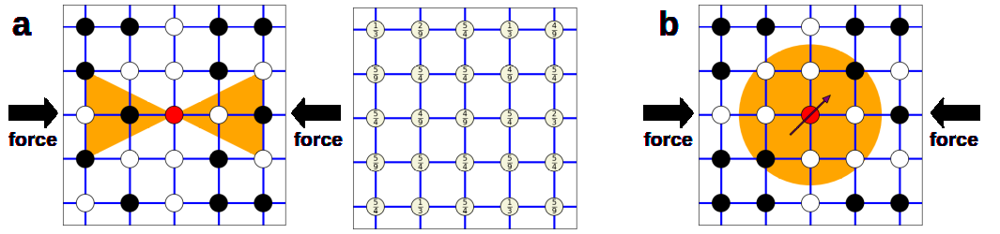

# Background and methods

```{admonition} Coverage
:class: important
This page annotates **Main manuscript**, source lines **314-402**. The original LaTeX source is reproduced in line-numbered blocks, followed by commentary explaining the role, assumptions, and interpretation of each block.
```

## Reading Lens

- This section gives the mathematical mechanism: how a voxel structure becomes a scalar or vector field, and how PH/ECP descriptors are extracted.
- Separate the non-directional baseline from the direction-aware modification. The comparison is only meaningful if the downstream learning model is kept comparable.
- The central technical issue is where the loading direction enters the pipeline: before topology is computed, not merely after features are produced.

## Annotated Source

### Background and methods

::::{admonition} Source lines 314-314
:class: note

```latex
 314 | \section{Background and methods}
```

**Readable text**

> Background and methods

**Commentary and remarks**

- This heading opens a new logical unit: **Background and methods**.
- Use it as a checkpoint: the paper is changing either scale, object, method, or evidential role.
- In the methods section, this block contributes to the pipeline that maps structure and direction into machine-learning features.
::::

#### Computing topological descriptors on the structures

::::{admonition} Source lines 315-315
:class: note

```latex
 315 | \subsection{Computing topological descriptors on the structures}
```

**Readable text**

> Computing topological descriptors on the structures

**Commentary and remarks**

- This heading opens a new logical unit: **Computing topological descriptors on the structures**.
- Use it as a checkpoint: the paper is changing either scale, object, method, or evidential role.
- In the methods section, this block contributes to the pipeline that maps structure and direction into machine-learning features.
::::

::::{admonition} Source lines 316-324
:class: note

```latex
 316 | \begin{figure}
 317 |     \centering
 318 |     \includegraphics[width=\textwidth]{TDA_directional_horizontal_new.png}
 319 |     \caption{Diagrams \textbf{a} and \textbf{b} illustrate the calculation of filtration based on cones and principal components, respectively. The actual filtrations were calculated for three-dimensional grids, but for clarity, the examples are two-dimensional. Black and red circles represent non-empty fragments of material, while white circles represent empty spaces. In both cases, the filtration value is calculated for the central element marked in red.
 320 |     In the first image of diagram \textbf{a}, there are 5 non-empty and 4 empty elements in the constructed cones (orange triangles), so the filtration for the middle point is equal to $4/9$.
 321 |     By applying this procedure to other grid points, we obtain the grid of numbers presented in the second image in diagram \textbf{a}.
 322 |     In diagram \textbf{b}, if we limit ourselves only to elements contained in a certain neighborhood (orange circle), all non-empty elements will lie along one direction (marked with a purple arrow). This direction is the basis for calculating the multifiltration value.}
 323 |     \label{fig:TDA_directional}
 324 | \end{figure}
```

**Readable text**

> Diagrams a and b illustrate the calculation of filtration based on cones and principal components, respectively. The actual filtrations were calculated for three-dimensional grids, but for clarity, the examples are two-dimensional. Black and red circles represent non-empty fragments of material, while white circles represent empty spaces. In both cases, the filtration value is calculated for the central element marked in red. In the first image of diagram a, there are 5 non-empty and 4 empty elements in the constructed cones (orange triangles), so the filtration for the middle point is equal to $4/9$. By applying this procedure to other grid points, we obtain the grid of numbers presented in the second image in diagram a. In diagram b, if we limit ourselves only to elements contained in a certain neighborhood (orange circle), all non-empty elements will lie along one direction (marked with a purple arrow). This direction is the basis for calculating the multifiltration value.

**Figure assets carried into the book**



**Commentary and remarks**

- This figure is evidential, not decorative: it gives visual grounding for the structures, descriptors, or performance pattern discussed around it.
- Read the caption carefully because it usually encodes the variables and comparisons that make the visual scientifically meaningful.
- This introduces or uses TDA as a multiscale language for connectivity, loops, cavities, and Euler-characteristic summaries.
- This is central to the paper: the loading direction must survive the descriptor construction because the material response is axis-dependent.
- The cone construction is the simplest place where direction enters the filtration: neighborhoods are sampled relative to a chosen axis.
::::

##### Topological data analysis

::::{admonition} Source lines 326-326
:class: note

```latex
 326 | \subsubsection{Topological data analysis}
```

**Readable text**

> Topological data analysis

**Commentary and remarks**

- This heading opens a new logical unit: **Topological data analysis**.
- Use it as a checkpoint: the paper is changing either scale, object, method, or evidential role.
- This introduces or uses TDA as a multiscale language for connectivity, loops, cavities, and Euler-characteristic summaries.
- In the methods section, this block contributes to the pipeline that maps structure and direction into machine-learning features.
::::

::::{admonition} Source lines 328-328
:class: note

```latex
 328 | Topological data analysis (TDA) leverages the tools of topology and algebra to extract relevant information from datasets. The fundamental principle of this methodology is that "Data has shape and shape has meaning"~\cite{Dlotko2024}. The reader is referred to~\cite{Dlotko2024, Gurnari2025} for a comprehensive overview of the basic concepts. Here, we present a brief outline of the TDA methods we will use. 
```

**Readable text**

> Topological data analysis (TDA) leverages the tools of topology and algebra to extract relevant information from datasets. The fundamental principle of this methodology is that "Data has shape and shape has meaning" (citation: Dlotko2024). The reader is referred to (citation: Dlotko2024, Gurnari2025) for a comprehensive overview of the basic concepts. Here, we present a brief outline of the TDA methods we will use.

**Commentary and remarks**

- This introduces or uses TDA as a multiscale language for connectivity, loops, cavities, and Euler-characteristic summaries.
- In the methods section, this block contributes to the pipeline that maps structure and direction into machine-learning features.
::::

::::{admonition} Source lines 332-332
:class: note

```latex
 332 | To represent the topology of the structures, we used 3-dimensional cubical complexes, which consist of cubes of various dimensions. TDA enables the analysis of data structures at multiple resolutions, which are defined using a function called filtration~\cite{Dlotko2024, Gurnari2025}. The initial values of this function were computed for 0-dimensional cubes (vertices) and then propagated to higher-dimensional cells in a standard manner, known as V-construction~\cite{Robins2011}.
```

**Readable text**

> To represent the topology of the structures, we used 3-dimensional cubical complexes, which consist of cubes of various dimensions. TDA enables the analysis of data structures at multiple resolutions, which are defined using a function called filtration (citation: Dlotko2024, Gurnari2025). The initial values of this function were computed for 0-dimensional cubes (vertices) and then propagated to higher-dimensional cells in a standard manner, known as V-construction (citation: Robins2011).

**Commentary and remarks**

- This introduces or uses TDA as a multiscale language for connectivity, loops, cavities, and Euler-characteristic summaries.
- This broadens the study beyond RTP by adding structurally diverse families that test whether the descriptor idea generalizes.
- In the methods section, this block contributes to the pipeline that maps structure and direction into machine-learning features.
::::

::::{admonition} Source lines 334-334
:class: note

```latex
 334 | The filtrations chosen in previous applications of TDA to porous materials are based on the distance transform and therefore do not account for directionality~\cite{Robins2016, Herring2019, Moon2019, Thompson2023, Lisitsa2020, Lee2017, Krishnapriyan2021, Chen2025, Wang2025, Jiang2018, Ishihara2023}. However, directionality is a critical factor for anisotropic materials whose Young's modulus depends on the direction of compression. To address this, we encoded the compression direction information into the filtration functions, thereby making our descriptors direction-aware. The details of these functions are described in the next section.
```

**Readable text**

> The filtrations chosen in previous applications of TDA to porous materials are based on the distance transform and therefore do not account for directionality (citation: Robins2016, Herring2019, Moon2019, Thompson2023, Lisitsa2020, Lee2017, Krishnapriyan2021, Chen2025, Wang2025, Jiang2018, Ishihara2023). However, directionality is a critical factor for anisotropic materials whose Young's modulus depends on the direction of compression. To address this, we encoded the compression direction information into the filtration functions, thereby making our descriptors direction-aware. The details of these functions are described in the next section.

**Commentary and remarks**

- This keeps the physical object in view: porous solid/void geometry is the structure whose topology and mechanics are being related.
- This connects geometry to the target variable: directional Young's modulus under a specified loading axis.
- This introduces or uses TDA as a multiscale language for connectivity, loops, cavities, and Euler-characteristic summaries.
- This is central to the paper: the loading direction must survive the descriptor construction because the material response is axis-dependent.
- In the methods section, this block contributes to the pipeline that maps structure and direction into machine-learning features.
::::

##### Cone-based filtration

::::{admonition} Source lines 336-336
:class: note

```latex
 336 | \subsubsection{Cone-based filtration}
```

**Readable text**

> Cone-based filtration

**Commentary and remarks**

- This heading opens a new logical unit: **Cone-based filtration**.
- Use it as a checkpoint: the paper is changing either scale, object, method, or evidential role.
- The cone construction is the simplest place where direction enters the filtration: neighborhoods are sampled relative to a chosen axis.
- In the methods section, this block contributes to the pipeline that maps structure and direction into machine-learning features.
::::

::::{admonition} Source lines 338-338
:class: note

```latex
 338 | The first directional filtration we consider is based on porosity inside cones. For each element of the input grid two cones starting at this point and having rotational axis parallel to direction of compressions are constructed. The cones are positioned in opposite directions. In the case of extreme grid elements, the cones may extend beyond the boundaries of the defined material. Therefore, for calculation purposes, we assume that the material is periodic. Porosity inside the cones is filtration value assigned to vertex corresponding to selected element of the grid. If the grid element represents an empty space, the corresponding filtration value is set to 1.25. The value 1.25 is selected arbitrary so that all the grid points outside material enters the filtration after all the grid elements belonging to material (that have filtration values between 0 and 1). This is to make a clear distinction between empty and non-empty spaces in the structure. The method is presented graphically in the Figure~\ref{fig:TDA_directional}. The formal definition of the described filtration is as follows.
```

**Readable text**

> The first directional filtration we consider is based on porosity inside cones. For each element of the input grid two cones starting at this point and having rotational axis parallel to direction of compressions are constructed. The cones are positioned in opposite directions. In the case of extreme grid elements, the cones may extend beyond the boundaries of the defined material. Therefore, for calculation purposes, we assume that the material is periodic. Porosity inside the cones is filtration value assigned to vertex corresponding to selected element of the grid. If the grid element represents an empty space, the corresponding filtration value is set to 1.25. The value 1.25 is selected arbitrary so that all the grid points outside material enters the filtration after all the grid elements belonging to material (that have filtration values between 0 and 1). This is to make a clear distinction between empty and non-empty spaces in the structure. The method is presented graphically in the Figure (ref: fig:TDA_directional). The formal definition of the described filtration is as follows.

**Commentary and remarks**

- This connects geometry to the target variable: directional Young's modulus under a specified loading axis.
- This is the density-baseline motivation: porosity alone is treated as insufficient for predicting stiffness across complex porous morphologies.
- This introduces or uses TDA as a multiscale language for connectivity, loops, cavities, and Euler-characteristic summaries.
- This is central to the paper: the loading direction must survive the descriptor construction because the material response is axis-dependent.
- The cone construction is the simplest place where direction enters the filtration: neighborhoods are sampled relative to a chosen axis.
::::

::::{admonition} Source lines 340-343
:class: note

```latex
 340 | \begin{definition}
 341 | A double cone with height $h$ and radius $r$ attached at point $e=(i_0, j_0, k_0)$ is defined as the following set of indices
 342 | \[ \mathrm{Cone}(e, r, h) = \left\{ (i, j, k) \in \mathcal{N}: |k - k_0| < h \land \sqrt{|i -i_0|^2 + |j -j_0|^2} \leq \frac{|k-k_0|r}{h}  \right\}  \]
 343 | \end{definition}
```

**Commentary and remarks**

- This mathematical block defines part of the computational object used later in the pipeline.
- Track the variables here: later descriptors and model inputs inherit these definitions.
- The cone construction is the simplest place where direction enters the filtration: neighborhoods are sampled relative to a chosen axis.
- In the methods section, this block contributes to the pipeline that maps structure and direction into machine-learning features.
::::

::::{admonition} Source lines 345-349
:class: note

```latex
 345 | \begin{definition}
 346 | Let $G$ be a three-dimensional lattice (grid) of size $n \times n \times n$. The cone-based filtration associated with the vertex corresponding to the grid element $g_e$ is given by the expression
 347 |     \[F_{cone}(e; r,h) =1 - \frac{1}{|\mathrm{Cone}(e, r, h)|} {\sum_{(i,j,k) \in {\mathrm{Cone}}(e, r, h)}{g_{i'j'k'}}}, \]
 348 |     where $i' = i \mod n$, $ j' = j \mod n$, $ k' = k \mod n$ and $|\mathrm{Cone}(e, r, h)|$ is the number of voxels within the cone.
 349 | \end{definition}
```

**Commentary and remarks**

- This mathematical block defines part of the computational object used later in the pipeline.
- Track the variables here: later descriptors and model inputs inherit these definitions.
- This keeps the physical object in view: porous solid/void geometry is the structure whose topology and mechanics are being related.
- The cone construction is the simplest place where direction enters the filtration: neighborhoods are sampled relative to a chosen axis.
- In the methods section, this block contributes to the pipeline that maps structure and direction into machine-learning features.
::::

::::{admonition} Source lines 351-351
:class: note

```latex
 351 | Cone-based filtration distinguishes the direction of compression ($z$-axis here) and is invariant under rotation around an axis parallel to that direction. This method takes two parameters, the cone's height and radius of its base.
```

**Readable text**

> Cone-based filtration distinguishes the direction of compression ($z$-axis here) and is invariant under rotation around an axis parallel to that direction. This method takes two parameters, the cone's height and radius of its base.

**Commentary and remarks**

- This connects geometry to the target variable: directional Young's modulus under a specified loading axis.
- This is central to the paper: the loading direction must survive the descriptor construction because the material response is axis-dependent.
- The cone construction is the simplest place where direction enters the filtration: neighborhoods are sampled relative to a chosen axis.
- In the methods section, this block contributes to the pipeline that maps structure and direction into machine-learning features.
::::

##### Filtration's extension based on principal component

::::{admonition} Source lines 353-353
:class: note

```latex
 353 | \subsubsection{Filtration's extension based on principal component}
```

**Readable text**

> Filtration's extension based on principal component

**Commentary and remarks**

- This heading opens a new logical unit: **Filtration's extension based on principal component**.
- Use it as a checkpoint: the paper is changing either scale, object, method, or evidential role.
- The principal-component construction adds local orientation information and supports multiparameter Euler-characteristic descriptors.
- In the methods section, this block contributes to the pipeline that maps structure and direction into machine-learning features.
::::

::::{admonition} Source lines 354-354
:class: note

```latex
 354 | In the next step, we extended our initial filtration method to include information about the local material direction within specific regions. The local material direction for each material was represented by two parameters, which we determined through the following procedure.
```

**Readable text**

> In the next step, we extended our initial filtration method to include information about the local material direction within specific regions. The local material direction for each material was represented by two parameters, which we determined through the following procedure.

**Commentary and remarks**

- This is central to the paper: the loading direction must survive the descriptor construction because the material response is axis-dependent.
- In the methods section, this block contributes to the pipeline that maps structure and direction into machine-learning features.
::::

::::{admonition} Source lines 356-356
:class: note

```latex
 356 | For a selected grid element e, we treated all non-zero grid elements within a centered sphere of a radius $r$ as a 3D point cloud. We then calculated the first principal component  of this cloud to define its primary directional axis. The resulting normalized vector was used to extract two components: one corresponding to the compression direction ($v_z$) and a second, independent component ($v_y$).
```

**Readable text**

> For a selected grid element e, we treated all non-zero grid elements within a centered sphere of a radius $r$ as a 3D point cloud. We then calculated the first principal component of this cloud to define its primary directional axis. The resulting normalized vector was used to extract two components: one corresponding to the compression direction ($v_z$) and a second, independent component ($v_y$).

**Commentary and remarks**

- This connects geometry to the target variable: directional Young's modulus under a specified loading axis.
- This is central to the paper: the loading direction must survive the descriptor construction because the material response is axis-dependent.
- The principal-component construction adds local orientation information and supports multiparameter Euler-characteristic descriptors.
- In the methods section, this block contributes to the pipeline that maps structure and direction into machine-learning features.
::::

::::{admonition} Source lines 358-358
:class: note

```latex
 358 | This process results in a 2-parameter filtration value, specifically $(1-|v_z|,1-|v_y|) $. This filtration is motivated by the principle that a material's ability to transfer stress is maximized when its orientation aligns with the imposed compression direction. The method requires a single hyperparameter: the radius of the point's neighborhood. A recap of this method is shown in the Figure {\ref{fig:TDA_directional}}
```

**Readable text**

> This process results in a 2-parameter filtration value, specifically $(1-|v_z|,1-|v_y|) $. This filtration is motivated by the principle that a material's ability to transfer stress is maximized when its orientation aligns with the imposed compression direction. The method requires a single hyperparameter: the radius of the point's neighborhood. A recap of this method is shown in the Figure (ref: fig:TDA_directional)

**Commentary and remarks**

- This connects geometry to the target variable: directional Young's modulus under a specified loading axis.
- This introduces or uses TDA as a multiscale language for connectivity, loops, cavities, and Euler-characteristic summaries.
- This is central to the paper: the loading direction must survive the descriptor construction because the material response is axis-dependent.
- In the methods section, this block contributes to the pipeline that maps structure and direction into machine-learning features.
::::

::::{admonition} Source lines 360-360
:class: note

```latex
 360 | The hyperparameters used in the filtration procedures were fixed across all experiments. For the cone-based filtration, the cone height was set to $h_{\mathrm{cone}} = 6$ and the cone base radius to $r_{\mathrm{cone}} = 3$. The same geometric parameters were employed for both the single-parameter filtration used in persistent homology and the multifiltration used in Euler characteristic profile calculations. In the principal-component-based multifiltration, the neighborhood radius was set to $r_{\mathrm{PC1}} = 4$, defining the spherical region used to estimate the local material orientation.
```

**Readable text**

> The hyperparameters used in the filtration procedures were fixed across all experiments. For the cone-based filtration, the cone height was set to $h_cone = 6$ and the cone base radius to $r_cone = 3$. The same geometric parameters were employed for both the single-parameter filtration used in persistent homology and the multifiltration used in Euler characteristic profile calculations. In the principal-component-based multifiltration, the neighborhood radius was set to $r_PC1 = 4$, defining the spherical region used to estimate the local material orientation.

**Commentary and remarks**

- This introduces or uses TDA as a multiscale language for connectivity, loops, cavities, and Euler-characteristic summaries.
- The cone construction is the simplest place where direction enters the filtration: neighborhoods are sampled relative to a chosen axis.
- The principal-component construction adds local orientation information and supports multiparameter Euler-characteristic descriptors.
- In the methods section, this block contributes to the pipeline that maps structure and direction into machine-learning features.
::::

::::{admonition} Source lines 364-382
:class: note

```latex
 364 | \begin{algorithm}
 365 | \caption{An algorithm of computing principal component-based multifiltration}\label{alg:cap}
 366 | \textbf{Input} \\
 367 |   \hspace*{\algorithmicindent}  $G$ - binary grid representing material \\
 368 |   \hspace*{\algorithmicindent}  $(i, j, k)$ - coordinates of selected element \\
 369 |   \hspace*{\algorithmicindent}  $r$ - neighborhood's radius
 370 | \begin{algorithmic}
 371 | \Procedure{PcFiltration}{$G,(i,j,k),r$}
 372 | \If{$G[i,j,k] = 0$}
 373 |     \State \Return (1.25, 1.25)
 374 | \Else
 375 |     \State $neighborhood \gets \mathrm{get\_neighborhood(G, (i,j,k), r)}$
 376 |     \State $v \gets \mathrm{calculate\_first\_principal\_component}(neighborhood)$
 377 |     \State $v \gets v / |v|$ \Comment{Normalization of 1st principal component}
 378 |     \State \Return $(1 - |v[2]|, 1 - |v[1]|)$
 379 | \EndIf
 380 | \EndProcedure
 381 | \end{algorithmic}
 382 | \end{algorithm}
```

**Commentary and remarks**

- This mathematical block defines part of the computational object used later in the pipeline.
- Track the variables here: later descriptors and model inputs inherit these definitions.
- This explains how continuous fields become admissible binary materials and why connectivity/percolation filters are needed for mechanical tests.
- The principal-component construction adds local orientation information and supports multiparameter Euler-characteristic descriptors.
- In the methods section, this block contributes to the pipeline that maps structure and direction into machine-learning features.
::::

##### Direction-aware topological descriptors

::::{admonition} Source lines 385-385
:class: note

```latex
 385 | \subsubsection{Direction-aware topological descriptors}
```

**Readable text**

> Direction-aware topological descriptors

**Commentary and remarks**

- This heading opens a new logical unit: **Direction-aware topological descriptors**.
- Use it as a checkpoint: the paper is changing either scale, object, method, or evidential role.
- This is central to the paper: the loading direction must survive the descriptor construction because the material response is axis-dependent.
- In the methods section, this block contributes to the pipeline that maps structure and direction into machine-learning features.
::::

::::{admonition} Source lines 387-387
:class: note

```latex
 387 | The filtrations described above were applied to study the structures at various resolutions. Next, we generated their topological summaries using persistent homology (for cone-based filtration) and Euler characteristic profiles (ECP) (for multifiltration). Persistent Homology (PH) is a fundamental tool in TDA. It offers the advantage of simultaneously capturing structural features, such as connected components, rings, and voids, at various scales. While ECP offers a less detailed topological description, it is computationally very efficient and allows for the use of multiparameter filtrations.
```

**Readable text**

> The filtrations described above were applied to study the structures at various resolutions. Next, we generated their topological summaries using persistent homology (for cone-based filtration) and Euler characteristic profiles (ECP) (for multifiltration). Persistent Homology (PH) is a fundamental tool in TDA. It offers the advantage of simultaneously capturing structural features, such as connected components, rings, and voids, at various scales. While ECP offers a less detailed topological description, it is computationally very efficient and allows for the use of multiparameter filtrations.

**Commentary and remarks**

- This keeps the physical object in view: porous solid/void geometry is the structure whose topology and mechanics are being related.
- This introduces or uses TDA as a multiscale language for connectivity, loops, cavities, and Euler-characteristic summaries.
- The cone construction is the simplest place where direction enters the filtration: neighborhoods are sampled relative to a chosen axis.
- The principal-component construction adds local orientation information and supports multiparameter Euler-characteristic descriptors.
- In the methods section, this block contributes to the pipeline that maps structure and direction into machine-learning features.
::::

::::{admonition} Source lines 389-389
:class: note

```latex
 389 | In the case of Persistent Homology calculations, the assumption of periodicity of the material in the  compression direction was used. Euler characteristic profiles were calculated without assuming periodicity in any direction. 
```

**Readable text**

> In the case of Persistent Homology calculations, the assumption of periodicity of the material in the compression direction was used. Euler characteristic profiles were calculated without assuming periodicity in any direction.

**Commentary and remarks**

- This connects geometry to the target variable: directional Young's modulus under a specified loading axis.
- This introduces or uses TDA as a multiscale language for connectivity, loops, cavities, and Euler-characteristic summaries.
- This is central to the paper: the loading direction must survive the descriptor construction because the material response is axis-dependent.
- In the methods section, this block contributes to the pipeline that maps structure and direction into machine-learning features.
::::

::::{admonition} Source lines 392-392
:class: note

```latex
 392 | Since most machine learning models require vector-formatted inputs, persistence diagrams were converted into persistence images~\cite{JMLR:v18:16-337}. Each diagram was mapped to a $10 \times 10$ image with birth and persistence ranges both set to $(0, 1.25)$. Persistence diagrams in dimensions 0, 1, and 2 were vectorized separately and subsequently concatenated into a single descriptor. Euler characteristic profiles were vectorized independently by sampling the multifiltration values on a $7 \times 7 \times 7$ grid.
```

**Readable text**

> Since most machine learning models require vector-formatted inputs, persistence diagrams were converted into persistence images (citation: JMLR:v18:16-337). Each diagram was mapped to a $10 x 10$ image with birth and persistence ranges both set to $(0, 1.25)$. Persistence diagrams in dimensions 0, 1, and 2 were vectorized separately and subsequently concatenated into a single descriptor. Euler characteristic profiles were vectorized independently by sampling the multifiltration values on a $7 x 7 x 7$ grid.

**Commentary and remarks**

- This introduces or uses TDA as a multiscale language for connectivity, loops, cavities, and Euler-characteristic summaries.
- The principal-component construction adds local orientation information and supports multiparameter Euler-characteristic descriptors.
- In the methods section, this block contributes to the pipeline that maps structure and direction into machine-learning features.
::::

#### Estimation using boosting algorithm and neural networks

::::{admonition} Source lines 394-394
:class: note

```latex
 394 | \subsection{Estimation using boosting algorithm and neural networks}
```

**Readable text**

> Estimation using boosting algorithm and neural networks

**Commentary and remarks**

- This heading opens a new logical unit: **Estimation using boosting algorithm and neural networks**.
- Use it as a checkpoint: the paper is changing either scale, object, method, or evidential role.
- This sets the learning comparison: compact topological descriptors with gradient boosting versus voxel-level convolutional models.
- In the methods section, this block contributes to the pipeline that maps structure and direction into machine-learning features.
::::

::::{admonition} Source lines 396-396
:class: note

```latex
 396 | Vectorized topological descriptors were used to train machine learning models aimed at predicting the elastic properties of the corresponding porous structures. Predictive models based on topological descriptors were trained using the CatBoost algorithm, a gradient-boosted decision tree method designed to provide strong performance and robustness on structured tabular data~\cite{Prokhorenkova2019}. As a baseline, we employed a convolutional neural network with the DenseNet-121 architecture, trained directly on voxelized representations of the structures. This architecture has previously been shown to achieve state-of-the-art performance for predicting mechanical properties of RTP-type porous structures~\cite{praca_z_madrytem}.
```

**Readable text**

> Vectorized topological descriptors were used to train machine learning models aimed at predicting the elastic properties of the corresponding porous structures. Predictive models based on topological descriptors were trained using the CatBoost algorithm, a gradient-boosted decision tree method designed to provide strong performance and robustness on structured tabular data (citation: Prokhorenkova2019). As a baseline, we employed a convolutional neural network with the DenseNet-121 architecture, trained directly on voxelized representations of the structures. This architecture has previously been shown to achieve state-of-the-art performance for predicting mechanical properties of RTP-type porous structures (citation: praca_z_madrytem).

**Commentary and remarks**

- This keeps the physical object in view: porous solid/void geometry is the structure whose topology and mechanics are being related.
- This connects geometry to the target variable: directional Young's modulus under a specified loading axis.
- This defines the RTP construction, where anisotropy is controlled in Fourier space before thresholding into a porous structure.
- This sets the learning comparison: compact topological descriptors with gradient boosting versus voxel-level convolutional models.
- In the methods section, this block contributes to the pipeline that maps structure and direction into machine-learning features.
::::

::::{admonition} Source lines 398-398
:class: note

```latex
 398 | Model training was performed using $k$-fold cross-validation with $k = 8$. The entire dataset was divided into eight folds. For the first model, folds 1–6 were used for training, the 7th fold served as a validation set to detect overfitting and determine when to stop training, and the 8th fold was used as the test set. All metrics reported in this paper were computed exclusively on the test sets. The second model was trained on folds 2–7, validated on fold 8, and tested on fold 1, and so on. Thus, for each algorithm, a total of eight models were trained, and the overall performance was obtained by averaging the metrics across all test sets. Using cross-validation increases the robustness of the results to random data splits. Moreover, it ensures that each data point is used exactly once as a test instance, allowing the reported metrics to represent the entire dataset.
```

**Readable text**

> Model training was performed using $k$-fold cross-validation with $k = 8$. The entire dataset was divided into eight folds. For the first model, folds 1–6 were used for training, the 7th fold served as a validation set to detect overfitting and determine when to stop training, and the 8th fold was used as the test set. All metrics reported in this paper were computed exclusively on the test sets. The second model was trained on folds 2–7, validated on fold 8, and tested on fold 1, and so on. Thus, for each algorithm, a total of eight models were trained, and the overall performance was obtained by averaging the metrics across all test sets. Using cross-validation increases the robustness of the results to random data splits. Moreover, it ensures that each data point is used exactly once as a test instance, allowing the reported metrics to represent the entire dataset.

**Commentary and remarks**

- In the methods section, this block contributes to the pipeline that maps structure and direction into machine-learning features.
::::

::::{admonition} Source lines 400-400
:class: note

```latex
 400 | To prevent data leakage, all $k$-fold cross-validation splits were performed at the structure level (stratification). When multiple Young’s modulus values were obtained from the same structure under different loading directions, these samples were assigned jointly to the training, validation, or test set within each fold. This ensured that mechanical responses of a given structure were never split across different subsets, providing a strict and physically meaningful evaluation of model generalization.
```

**Readable text**

> To prevent data leakage, all $k$-fold cross-validation splits were performed at the structure level (stratification). When multiple Young’s modulus values were obtained from the same structure under different loading directions, these samples were assigned jointly to the training, validation, or test set within each fold. This ensured that mechanical responses of a given structure were never split across different subsets, providing a strict and physically meaningful evaluation of model generalization.

**Commentary and remarks**

- This connects geometry to the target variable: directional Young's modulus under a specified loading axis.
- This is central to the paper: the loading direction must survive the descriptor construction because the material response is axis-dependent.
- In the methods section, this block contributes to the pipeline that maps structure and direction into machine-learning features.
::::

