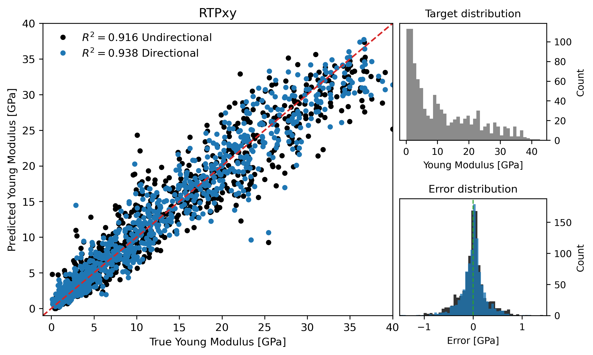
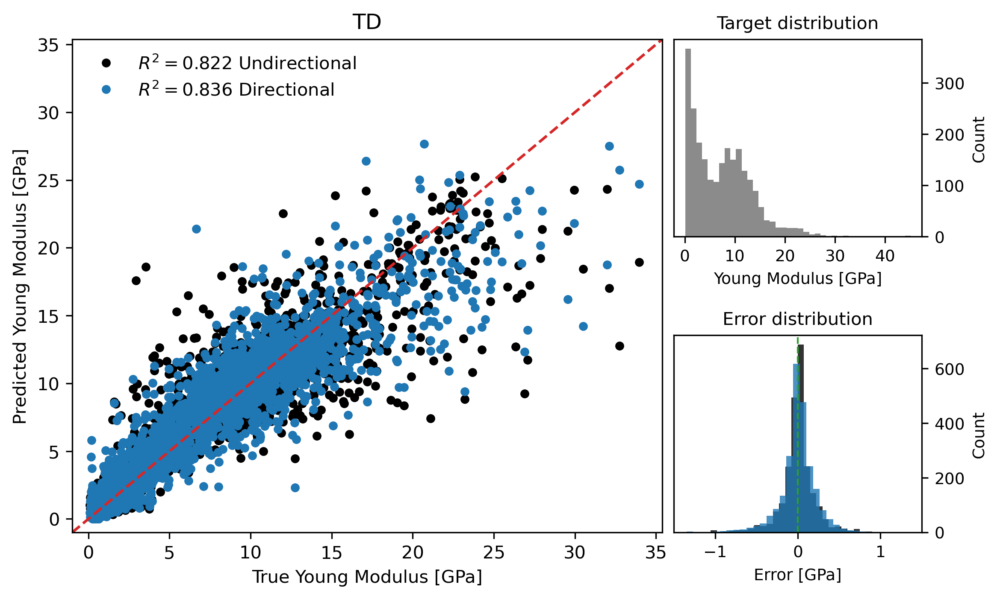
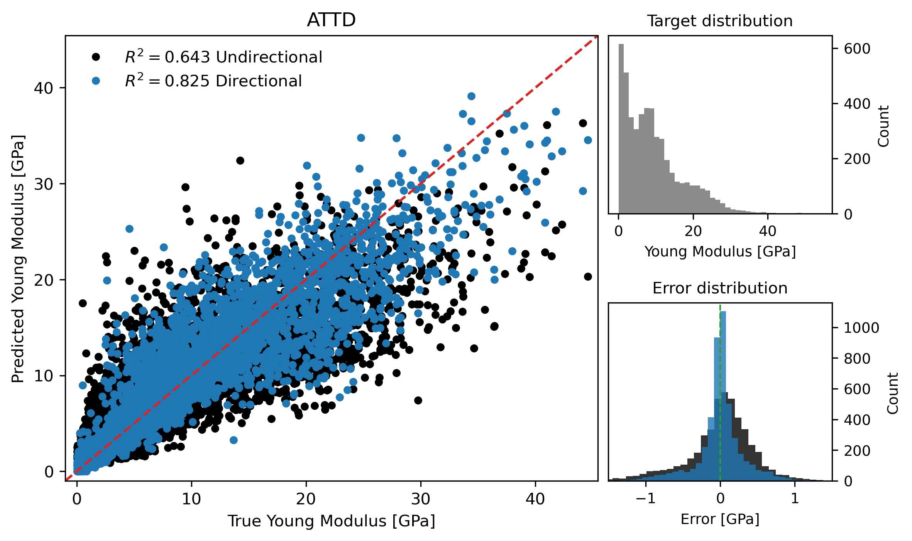

# Results and Discussion

```{admonition} Coverage
:class: important
This page annotates **Main manuscript**, source lines **403-579**. The original LaTeX source is reproduced in line-numbered blocks, followed by commentary explaining the role, assumptions, and interpretation of each block.
```

## Reading Lens

- This section is the empirical test of the paper's thesis. Read every reported score as a comparison between direction-agnostic topology, direction-aware topology, and voxel CNN baselines.
- The important pattern is not a single best number but the relationship between anisotropy and the gain from direction-aware descriptors.
- Use the tables and figures to distinguish strong-anisotropy wins, weak-anisotropy parity, and cases where descriptor families behave differently.

## Annotated Source

### Results and Discussion

::::{admonition} Source lines 403-403
:class: note

```latex
 403 | \section{Results and Discussion}
```

**Readable text**

> Results and Discussion

**Commentary and remarks**

- This heading opens a new logical unit: **Results and Discussion**.
- Use it as a checkpoint: the paper is changing either scale, object, method, or evidential role.
- In the results section, this block should be read as evidence for or against the claimed value of direction-aware descriptors.
::::

::::{admonition} Source lines 405-405
:class: note

```latex
 405 | Table~\ref{tab:metrics} summarizes the predictive performance of the evaluated descriptor configurations across all considered datasets. In addition to regression metrics, the table reports two scalar measures characterizing structural anisotropy: the spectral measure $k$ and the integral correlation-length-based measure $L$, both computed directly from the binary microstructures.
```

**Readable text**

> Table (ref: tab:metrics) summarizes the predictive performance of the evaluated descriptor configurations across all considered datasets. In addition to regression metrics, the table reports two scalar measures characterizing structural anisotropy: the spectral measure $k$ and the integral correlation-length-based measure $L$, both computed directly from the binary microstructures.

**Commentary and remarks**

- This keeps the physical object in view: porous solid/void geometry is the structure whose topology and mechanics are being related.
- This is central to the paper: the loading direction must survive the descriptor construction because the material response is axis-dependent.
- This explains how continuous fields become admissible binary materials and why connectivity/percolation filters are needed for mechanical tests.
- This supplies the scalar anisotropy summaries used to interpret when directional descriptors should matter most.
- In the results section, this block should be read as evidence for or against the claimed value of direction-aware descriptors.
::::

::::{admonition} Source lines 407-407
:class: note

```latex
 407 | For each dataset, the reported quantities are the standard deviations $\sigma(k)$ and $\sigma(L)$. These were computed from the directional values $k_\alpha$ and $L_\alpha$ corresponding to the same loading axes used to evaluate Young’s modulus in a given dataset. For example, for the RTPxy dataset, $\sigma(k)$ is calculated from the collection of $k_x$ and $k_y$ values across all structures, and $\sigma(L)$ analogously from $L_x$ and $L_y$. In this way, $\sigma(k)$ and $\sigma(L)$ quantify the spread of anisotropic characteristics within each dataset: larger values indicate greater variability in directional morphology, while smaller values correspond to more structurally homogeneous ensembles.
```

**Readable text**

> For each dataset, the reported quantities are the standard deviations $sigma(k)$ and $sigma(L)$. These were computed from the directional values $k_alpha$ and $L_alpha$ corresponding to the same loading axes used to evaluate Young’s modulus in a given dataset. For example, for the RTPxy dataset, $sigma(k)$ is calculated from the collection of $k_x$ and $k_y$ values across all structures, and $sigma(L)$ analogously from $L_x$ and $L_y$. In this way, $sigma(k)$ and $sigma(L)$ quantify the spread of anisotropic characteristics within each dataset: larger values indicate greater variability in directional morphology, while smaller values correspond to more structurally homogeneous ensembles.

**Commentary and remarks**

- This connects geometry to the target variable: directional Young's modulus under a specified loading axis.
- This is central to the paper: the loading direction must survive the descriptor construction because the material response is axis-dependent.
- This defines the RTP construction, where anisotropy is controlled in Fourier space before thresholding into a porous structure.
- This supplies the scalar anisotropy summaries used to interpret when directional descriptors should matter most.
- In the results section, this block should be read as evidence for or against the claimed value of direction-aware descriptors.
::::

::::{admonition} Source lines 410-417
:class: note

```latex
 410 | \begin{figure}
 411 |     \centering
 412 |     \includegraphics[width=0.495\linewidth]{scatter_rtp_xy.png}
 413 |     \includegraphics[width=0.495\linewidth]{scatter_rtp_xz.png}
 414 |     \caption{Predicted versus FFTMAD-computed Young’s modulus for the RTPxy (left panel) and RTPxz (right panel) datasets. In both cases, predictions were obtained using a CatBoost regression model trained on combined PH+ECP topological descriptors. The dashed line indicates perfect agreement between predicted and computed values. Black markers correspond to predictions based on non-directional descriptors, while blue markers denote predictions obtained using directional descriptors. Each panel includes two accompanying histograms: the upper histogram shows the distribution of Young’s modulus values in the dataset, and the lower histogram compares the distributions of prediction errors for non-directional and directional models.
 415 |     }
 416 |     \label{fig:scatter_rtp}
 417 | \end{figure}
```

**Readable text**

> Predicted versus FFTMAD-computed Young’s modulus for the RTPxy (left panel) and RTPxz (right panel) datasets. In both cases, predictions were obtained using a CatBoost regression model trained on combined PH+ECP topological descriptors. The dashed line indicates perfect agreement between predicted and computed values. Black markers correspond to predictions based on non-directional descriptors, while blue markers denote predictions obtained using directional descriptors. Each panel includes two accompanying histograms: the upper histogram shows the distribution of Young’s modulus values in the dataset, and the lower histogram compares the distributions of prediction errors for non-directional and directional models.

**Figure assets carried into the book**




**Commentary and remarks**

- This figure is evidential, not decorative: it gives visual grounding for the structures, descriptors, or performance pattern discussed around it.
- Read the caption carefully because it usually encodes the variables and comparisons that make the visual scientifically meaningful.
- This connects geometry to the target variable: directional Young's modulus under a specified loading axis.
- This is central to the paper: the loading direction must survive the descriptor construction because the material response is axis-dependent.
- This defines the RTP construction, where anisotropy is controlled in Fourier space before thresholding into a porous structure.
::::

::::{admonition} Source lines 419-419
:class: note

```latex
 419 | Figure~\ref{fig:scatter_rtp} shows predicted versus FFTMAD-computed Young’s modulus for the RTPxy (left) and RTPxz (right) datasets. Insets display the distributions of Young’s modulus values (top) and prediction errors (bottom). For the weakly anisotropic RTPxy dataset, both directional and non-directional descriptors yield predictions tightly clustered around perfect agreement with narrow, symmetric error distributions. In contrast, for the strongly anisotropic RTPxz dataset, directional descriptors maintain high accuracy, while non-directional descriptors exhibit substantial deviations and broadened error distributions, highlighting the importance of directional topology under strong anisotropy.
```

**Readable text**

> Figure (ref: fig:scatter_rtp) shows predicted versus FFTMAD-computed Young’s modulus for the RTPxy (left) and RTPxz (right) datasets. Insets display the distributions of Young’s modulus values (top) and prediction errors (bottom). For the weakly anisotropic RTPxy dataset, both directional and non-directional descriptors yield predictions tightly clustered around perfect agreement with narrow, symmetric error distributions. In contrast, for the strongly anisotropic RTPxz dataset, directional descriptors maintain high accuracy, while non-directional descriptors exhibit substantial deviations and broadened error distributions, highlighting the importance of directional topology under strong anisotropy.

**Commentary and remarks**

- This connects geometry to the target variable: directional Young's modulus under a specified loading axis.
- This is central to the paper: the loading direction must survive the descriptor construction because the material response is axis-dependent.
- This defines the RTP construction, where anisotropy is controlled in Fourier space before thresholding into a porous structure.
- This is the target-generation mechanism: the paper uses FFT-based homogenization rather than treating stiffness labels as empirical annotations.
- In the results section, this block should be read as evidence for or against the claimed value of direction-aware descriptors.
::::

::::{admonition} Source lines 421-442
:class: note

```latex
 421 | The RTP datasets provide a controlled setting for assessing the influence of
 422 | structural anisotropy on predictive performance.
 423 | We first consider the RTPxy dataset, which consists of RTP microstructures for which Young’s modulus was evaluated exclusively
 424 | along the $x$ and $y$ directions.
 425 | As a result, this dataset is statistically isotropic within the $xy$ plane and
 426 | does not exhibit a preferred mechanical hard axis.
 427 | Consistent with this interpretation, the average Young’s moduli along the two
 428 | directions are nearly identical, with mean values of
 429 | $E_x = 11.46\,\mathrm{GPa}$ and $E_y = 11.49\,\mathrm{GPa}$.
 430 | The corresponding anisotropy measures, based on the $x$ and $y$ axes, are lowest, with $\sigma(k)=0.11$ and $\sigma(L)=0.21$, indicating only
 431 | weak directional differentiation in the underlying pore morphology.
 432 | In contrast, the RTPxz dataset is constructed from the same set of RTP
 433 | microstructures but probes mechanical response along the $x$ and $z$
 434 | directions.
 435 | In this case, the $x$ direction acts as a mechanically easy axis
 436 | ($E_x = 11.46\,\mathrm{GPa}$), while the $z$ direction corresponds to a
 437 | pronounced hard axis, with an average Young’s modulus of
 438 | $E_z = 35.55\,\mathrm{GPa}$.
 439 | This strong directional contrast is reflected in substantially higher
 440 | anisotropy measures, with $\sigma(k)=0.40$ and $\sigma(L)=1.89$
 441 | (based on $x$ and $z$ axis), making RTPxz the most anisotropic dataset among all
 442 | those considered.
```

**Readable text**

> The RTP datasets provide a controlled setting for assessing the influence of structural anisotropy on predictive performance. We first consider the RTPxy dataset, which consists of RTP microstructures for which Young’s modulus was evaluated exclusively along the $x$ and $y$ directions. As a result, this dataset is statistically isotropic within the $xy$ plane and does not exhibit a preferred mechanical hard axis. Consistent with this interpretation, the average Young’s moduli along the two directions are nearly identical, with mean values of $E_x = 11.46 GPa$ and $E_y = 11.49 GPa$. The corresponding anisotropy measures, based on the $x$ and $y$ axes, are lowest, with $sigma(k)=0.11$ and $sigma(L)=0.21$, indicating only weak directional differentiation in the underlying pore morphology. In contrast, the RTPxz dataset is constructed from the same set of RTP microstructures but probes mechanical response along the $x$ and $z$ directions. In this case, the $x$ direction acts as a mechanically easy axis ($E_x = 11.46 GPa$), while the $z$ direction corresponds to a pronounced hard axis, with an average Young’s modulus of $E_z = 35.55 GPa$. This strong directional contrast is reflected in substantially higher anisotropy measures, with $sigma(k)=0.40$ and $sigma(L)=1.89$ (based on $x$ and $z$ axis), making RTPxz the most anisotropic dataset among all those considered.

**Commentary and remarks**

- This keeps the physical object in view: porous solid/void geometry is the structure whose topology and mechanics are being related.
- This connects geometry to the target variable: directional Young's modulus under a specified loading axis.
- This is central to the paper: the loading direction must survive the descriptor construction because the material response is axis-dependent.
- This defines the RTP construction, where anisotropy is controlled in Fourier space before thresholding into a porous structure.
- This supplies the scalar anisotropy summaries used to interpret when directional descriptors should matter most.
::::

::::{admonition} Source lines 445-457
:class: note

```latex
 445 | For the strongly anisotropic RTPxz dataset, the benefit of directional topology
 446 | is pronounced.
 447 | When persistent homology (PH) descriptors are used without directional
 448 | information, predictive performance is poor ($R^2=0.463$, MAE $=9.42\,\mathrm{GPa}$),
 449 | indicating that non-directional PH fails to capture the dominant directional
 450 | features governing elastic response.
 451 | Introducing directionality leads to a dramatic improvement, with directional PH
 452 | achieving $R^2=0.954$ and a substantially reduced MAE of $2.65\,\mathrm{GPa}$.
 453 | A similar trend is observed for multifiltration Euler characteristic profiles
 454 | (ECP), where the transition from non-directional to directional descriptors
 455 | increases $R^2$ from $0.616$ to $0.978$ and reduces MAE from $12.06\,\mathrm{GPa}$ to $1.85\,\mathrm{GPa}$.
 456 | The combined PH+ECP representation yields the lowest error overall for RTPxz,
 457 | with directional models reaching $R^2=0.978$ and MAE $=1.86\,\mathrm{GPa}$.
```

**Readable text**

> For the strongly anisotropic RTPxz dataset, the benefit of directional topology is pronounced. When persistent homology (PH) descriptors are used without directional information, predictive performance is poor ($R^2=0.463$, MAE $=9.42 GPa$), indicating that non-directional PH fails to capture the dominant directional features governing elastic response. Introducing directionality leads to a dramatic improvement, with directional PH achieving $R^2=0.954$ and a substantially reduced MAE of $2.65 GPa$. A similar trend is observed for multifiltration Euler characteristic profiles (ECP), where the transition from non-directional to directional descriptors increases $R^2$ from $0.616$ to $0.978$ and reduces MAE from $12.06 GPa$ to $1.85 GPa$. The combined PH+ECP representation yields the lowest error overall for RTPxz, with directional models reaching $R^2=0.978$ and MAE $=1.86 GPa$.

**Commentary and remarks**

- This connects geometry to the target variable: directional Young's modulus under a specified loading axis.
- This introduces or uses TDA as a multiscale language for connectivity, loops, cavities, and Euler-characteristic summaries.
- This is central to the paper: the loading direction must survive the descriptor construction because the material response is axis-dependent.
- This defines the RTP construction, where anisotropy is controlled in Fourier space before thresholding into a porous structure.
- The principal-component construction adds local orientation information and supports multiparameter Euler-characteristic descriptors.
::::

::::{admonition} Source lines 459-480
:class: note

```latex
 459 | \begin{table}[]
 460 | \centering
 461 | \caption{Cross-validated regression performance for Young’s modulus prediction using boosting models trained on persistent homology (PH), Euler characteristic profiles (ECP), and their combination (PH+ECP), together with a convolutional neural network (CNN) baseline trained directly on voxelized structures. Reported metrics correspond to averages over 8 cross-validation folds.}
 462 | \label{tab:metrics}
 463 | \begin{tabular}{lcc|cc||l|rrrr}
 464 | \hline 
 465 |  & \multicolumn{2}{l}{} & \multicolumn{2}{|l||}{CNN baseline} &  & \multicolumn{2}{l}{Non-directional} & \multicolumn{2}{l}{Directional} \\
 466 | Dataset & $\sigma(k)$ & $\sigma(L)$ & $R^2$ & MAE & Method & $R^2$ & MAE & $R^2$ & MAE \\ \hline
 467 | RTPxz & 0.40 & 1.89 & 0.985 & 1.62 & PH & 0.463 & 9.42 & 0.954 & 2.65 \\
 468 |  &  &  &  &  & ECP & 0.616 & 12.06 & 0.978 & 1.85 \\
 469 |  &  &  &  &  & PH+ECP & 0.754 & 7.05 & 0.978 & 1.86 \\ \hline
 470 | RTPxy & 0.11 & 0.21 & 0.979 & 1.02 & PH & 0.878 & 2.42 & 0.873 & 2.45 \\
 471 |  &  &  &  &  & ECP & 0.925 & 1.86 & 0.940 & 1.66 \\
 472 |  &  &  &  &  & PH+ECP & 0.916 & 1.98 & 0.938 & 1.69 \\ \hline
 473 | TD & 0.14 & 1.80& 0.976 & 0.62 & PH & 0.596 & 2.44 & 0.665 & 2.18 \\
 474 |  &  &  &  &  & ECP & 0.815 & 1.48 & 0.818 & 1.66 \\
 475 |  &  &  &  &  & PH+ECP & 0.822 & 1.46 & 0.836 & 1.53 \\ \hline
 476 | ATTD & 0.20 & 1.74 & 0.894 & 0.34 & PH & 0.536 & 3.78 & 0.759 & 2.53 \\
 477 |  &  &  &  &  & ECP & 0.653 & 3.36 & 0.815 & 2.13 \\
 478 |  &  &  &  &  & PH+ECP & 0.643 & 3.33 & 0.825 & 2.06 \\ \hline
 479 | \end{tabular}
 480 | \end{table}
```

**Readable text**

> Cross-validated regression performance for Young’s modulus prediction using boosting models trained on persistent homology (PH), Euler characteristic profiles (ECP), and their combination (PH+ECP), together with a convolutional neural network (CNN) baseline trained directly on voxelized structures. Reported metrics correspond to averages over 8 cross-validation folds.

**Commentary and remarks**

- This table is a quantitative claim surface. Compare rows by dataset, descriptor family, directional status, and error metric rather than reading only the best score.
- The main inferential question is whether directional information improves prediction under the same learning setup.
- This keeps the physical object in view: porous solid/void geometry is the structure whose topology and mechanics are being related.
- This connects geometry to the target variable: directional Young's modulus under a specified loading axis.
- This introduces or uses TDA as a multiscale language for connectivity, loops, cavities, and Euler-characteristic summaries.
::::

::::{admonition} Source lines 482-496
:class: note

```latex
 482 | For the more weakly anisotropic RTPxy dataset, the performance gap between
 483 | directional and non-directional descriptors is smaller than for the strongly
 484 | anisotropic RTPxz case, but remains systematic and consistent across all
 485 | descriptor classes (with the the exception of PH alone, which is the weakest anyway for both directional and non-directional descriptors).
 486 | Although non-directional models already achieve high predictive accuracy
 487 | ($R^2=0.878$ for PH and $R^2=0.925$ for ECP), the inclusion of directional
 488 | information leads to simultaneous improvements in both variance explained and
 489 | absolute error for ECP and PH+ECP.
 490 | In particular, directional ECP increases $R^2$ from $0.925$ to $0.940$ while
 491 | reducing MAE from $1.86\,\mathrm{GPa}$ to $1.66\,\mathrm{GPa}$, and similar trends are observed PH+ECP descriptors.
 492 | Importantly, with the exception of PH on RTPxy, no instance is observed in which a non-directional representation outperforms its directional counterpart in terms of $R^2$, while in some cases non-directional representations slightly surpass directional ones in terms of MAE
 493 | This demonstrates that the shift to directional topology provides added predictive value for strongly anisotropic materials and does not decrease the predictive value
 494 | even when the probed mechanical response is nearly isotropic, and suggests that
 495 | non-directional descriptors offer no practical advantage once directional
 496 | alternatives are available.
```

**Readable text**

> For the more weakly anisotropic RTPxy dataset, the performance gap between directional and non-directional descriptors is smaller than for the strongly anisotropic RTPxz case, but remains systematic and consistent across all descriptor classes (with the the exception of PH alone, which is the weakest anyway for both directional and non-directional descriptors). Although non-directional models already achieve high predictive accuracy ($R^2=0.878$ for PH and $R^2=0.925$ for ECP), the inclusion of directional information leads to simultaneous improvements in both variance explained and absolute error for ECP and PH+ECP. In particular, directional ECP increases $R^2$ from $0.925$ to $0.940$ while reducing MAE from $1.86 GPa$ to $1.66 GPa$, and similar trends are observed PH+ECP descriptors. Importantly, with the exception of PH on RTPxy, no instance is observed in which a non-directional representation outperforms its directional counterpart in terms of $R^2$, while in some cases non-directional representations slightly surpass directional ones in terms of MAE This demonstrates that the shift to directional topology provides added predictive value for strongly anisotropic materials and does not decrease the predictive value even when the probed mechanical response is nearly isotropic, and suggests that non-directional descriptors offer no practical advantage once directional alternatives are available.

**Commentary and remarks**

- This is central to the paper: the loading direction must survive the descriptor construction because the material response is axis-dependent.
- This defines the RTP construction, where anisotropy is controlled in Fourier space before thresholding into a porous structure.
- This is a performance-interpretation block. Watch both $R^2$ and MAE because they answer different questions about explained variance and absolute error.
- In the results section, this block should be read as evidence for or against the claimed value of direction-aware descriptors.
::::

::::{admonition} Source lines 498-508
:class: note

```latex
 498 | Across both RTP datasets, ECP consistently outperforms PH when used alone, and
 499 | the combined PH+ECP descriptors provide the most accurate and stable predictions.
 500 | For reference, convolutional neural networks trained directly on voxelized
 501 | structures achieve uniformly high accuracy for both RTPxz and RTPxy
 502 | ($R^2=0.985$ and $0.979$, respectively), but the performance gap relative to
 503 | topological models narrows substantially for RTPxz when directional PH+ECP
 504 | descriptors are employed.
 505 | Overall, the RTP results demonstrate that the utility of directional topological
 506 | descriptors increases sharply with structural anisotropy, and that their impact
 507 | is most pronounced in regimes where elastic response is governed by a clear
 508 | mechanical hard axis. 
```

**Readable text**

> Across both RTP datasets, ECP consistently outperforms PH when used alone, and the combined PH+ECP descriptors provide the most accurate and stable predictions. For reference, convolutional neural networks trained directly on voxelized structures achieve uniformly high accuracy for both RTPxz and RTPxy ($R^2=0.985$ and $0.979$, respectively), but the performance gap relative to topological models narrows substantially for RTPxz when directional PH+ECP descriptors are employed. Overall, the RTP results demonstrate that the utility of directional topological descriptors increases sharply with structural anisotropy, and that their impact is most pronounced in regimes where elastic response is governed by a clear mechanical hard axis.

**Commentary and remarks**

- This keeps the physical object in view: porous solid/void geometry is the structure whose topology and mechanics are being related.
- This connects geometry to the target variable: directional Young's modulus under a specified loading axis.
- This is central to the paper: the loading direction must survive the descriptor construction because the material response is axis-dependent.
- This defines the RTP construction, where anisotropy is controlled in Fourier space before thresholding into a porous structure.
- This sets the learning comparison: compact topological descriptors with gradient boosting versus voxel-level convolutional models.
::::

::::{admonition} Source lines 510-510
:class: note

```latex
 510 | Results obtained for the combined-direction RTPxyz dataset further support these conclusions; see Section S2 (Table~S1 and Figure~S2) in the Supplementary Information.
```

**Readable text**

> Results obtained for the combined-direction RTPxyz dataset further support these conclusions; see Section S2 (Table~S1 and Figure~S2) in the Supplementary Information.

**Commentary and remarks**

- This is central to the paper: the loading direction must survive the descriptor construction because the material response is axis-dependent.
- This defines the RTP construction, where anisotropy is controlled in Fourier space before thresholding into a porous structure.
- In the results section, this block should be read as evidence for or against the claimed value of direction-aware descriptors.
::::

::::{admonition} Source lines 512-513
:class: note

```latex
 512 | To further substantiate the consistency of the performance gains across data splits, 
 513 | we provide detailed fold-wise cross-validation results in the Section S3 (Tables~S2 and S3) in the Supplementary Information.
```

**Readable text**

> To further substantiate the consistency of the performance gains across data splits, we provide detailed fold-wise cross-validation results in the Section S3 (Tables~S2 and S3) in the Supplementary Information.

**Commentary and remarks**

- This is a performance-interpretation block. Watch both $R^2$ and MAE because they answer different questions about explained variance and absolute error.
- In the results section, this block should be read as evidence for or against the claimed value of direction-aware descriptors.
::::

::::{admonition} Source lines 515-522
:class: note

```latex
 515 | \begin{figure}
 516 |     \centering
 517 |     \includegraphics[width=0.495\linewidth]{scatter_td.png}
 518 |     \includegraphics[width=0.495\linewidth]{scatter_attd.png}
 519 |     \caption{The same as Figure \ref{fig:scatter_rtp} but for TD dataset (left panel) and ATTD dataset (right panel).
 520 |     }
 521 |     \label{fig:scatter_td}
 522 | \end{figure}
```

**Readable text**

> The same as Figure (ref: fig:scatter_rtp) but for TD dataset (left panel) and ATTD dataset (right panel).

**Figure assets carried into the book**





**Commentary and remarks**

- This figure is evidential, not decorative: it gives visual grounding for the structures, descriptors, or performance pattern discussed around it.
- Read the caption carefully because it usually encodes the variables and comparisons that make the visual scientifically meaningful.
- This defines the RTP construction, where anisotropy is controlled in Fourier space before thresholding into a porous structure.
- This constructs anisotropy by transforming otherwise diverse structures, giving a bridge between controlled RTP anisotropy and heterogeneous real-looking morphologies.
- In the results section, this block should be read as evidence for or against the claimed value of direction-aware descriptors.
::::

::::{admonition} Source lines 525-539
:class: note

```latex
 525 | To verify that the observed trends are not specific to the RTP model or to a
 526 | particular class of microstructures, additional datasets were considered.
 527 | Specifically, a Topologically Diverse (TD) dataset was constructed to include porous
 528 | microstructures spanning a broad range of topologies (see Section \ref{sec:td_structures} and Section S1 in the Supplementary Information), while remaining statistically isotropic.
 529 | This dataset is characterized by low anisotropy, with
 530 | $\sigma(k)=0.14$ and $\sigma(L)=1.80$, and an average Young’s modulus of $7.46\,\mathrm{GPa}$.
 531 | For the TD dataset, the same qualitative trends observed for RTPxy persist.
 532 | ECP multifiltration descriptors outperform the PH descriptors in both directional and non-directional settings. 
 533 | Non-directional PH achieves only $R^2=0.596$ with MAE $=2.44\,\mathrm{GPa}$, whereas
 534 | non-directional ECP improves performance substantially to $R^2=0.815$ and MAE $=1.48\,\mathrm{GPa}$.
 535 | Directional descriptors again provide a consistent advantage in terms of $R^2$: directional
 536 | PH+ECP reaches $R^2=0.836$, outperforming all non-directional alternatives, while the latter have a slight advantage in terms of MAE for ECP and PH+ECP.
 537 | This reinforces the conclusion
 538 | that direction-aware topology is not detrimental even for nominally isotropic
 539 | datasets.
```

**Readable text**

> To verify that the observed trends are not specific to the RTP model or to a particular class of microstructures, additional datasets were considered. Specifically, a Topologically Diverse (TD) dataset was constructed to include porous microstructures spanning a broad range of topologies (see Section (ref: sec:td_structures) and Section S1 in the Supplementary Information), while remaining statistically isotropic. This dataset is characterized by low anisotropy, with $sigma(k)=0.14$ and $sigma(L)=1.80$, and an average Young’s modulus of $7.46 GPa$. For the TD dataset, the same qualitative trends observed for RTPxy persist. ECP multifiltration descriptors outperform the PH descriptors in both directional and non-directional settings. Non-directional PH achieves only $R^2=0.596$ with MAE $=2.44 GPa$, whereas non-directional ECP improves performance substantially to $R^2=0.815$ and MAE $=1.48 GPa$. Directional descriptors again provide a consistent advantage in terms of $R^2$: directional PH+ECP reaches $R^2=0.836$, outperforming all non-directional alternatives, while the latter have a slight advantage in terms of MAE for ECP and PH+ECP. This reinforces the conclusion that direction-aware topology is not detrimental even for nominally isotropic datasets.

**Commentary and remarks**

- This keeps the physical object in view: porous solid/void geometry is the structure whose topology and mechanics are being related.
- This connects geometry to the target variable: directional Young's modulus under a specified loading axis.
- This is central to the paper: the loading direction must survive the descriptor construction because the material response is axis-dependent.
- This defines the RTP construction, where anisotropy is controlled in Fourier space before thresholding into a porous structure.
- This broadens the study beyond RTP by adding structurally diverse families that test whether the descriptor idea generalizes.
::::

::::{admonition} Source lines 541-542
:class: note

```latex
 541 | A limitation of the TD dataset is that anisotropy cannot be introduced in a controlled manner at the level of microstructure generation. To address this, an Anisotropic Transformed Topologically Diverse (ATTD) dataset was constructed by elongating the original structures along a single axis, thereby introducing moderate but systematic anisotropy. This procedure increases the spectral anisotropy variability to $\sigma(k)=0.20$, while the correlation-length-based variability becomes $\sigma(L)=1.74$, and the average Young’s modulus increases to $9.36\,\mathrm{GPa}$.
 542 | Although ATTD is more anisotropic than TD—as reflected by the larger value of $\sigma(k)$—the value of $\sigma(L)$ is slightly lower. This stems from the definition of the correlation-length measure, which depends on the integral of the autocorrelation function up to its first zero crossing. In the TD and ATTD datasets, where structures are not generated from spectrally controlled random fields, the autocorrelation does not necessarily decay monotonically, and the elongation procedure can reduce variability in the position of the first zero crossing across samples. As a result, the spread of $L$ values may decrease even when directional anisotropy increases. In this context, $L$ serves primarily as an auxiliary real-space measure complementing the more sensitive spectral indicator $k$.
```

**Readable text**

> A limitation of the TD dataset is that anisotropy cannot be introduced in a controlled manner at the level of microstructure generation. To address this, an Anisotropic Transformed Topologically Diverse (ATTD) dataset was constructed by elongating the original structures along a single axis, thereby introducing moderate but systematic anisotropy. This procedure increases the spectral anisotropy variability to $sigma(k)=0.20$, while the correlation-length-based variability becomes $sigma(L)=1.74$, and the average Young’s modulus increases to $9.36 GPa$. Although ATTD is more anisotropic than TD—as reflected by the larger value of $sigma(k)$—the value of $sigma(L)$ is slightly lower. This stems from the definition of the correlation-length measure, which depends on the integral of the autocorrelation function up to its first zero crossing. In the TD and ATTD datasets, where structures are not generated from spectrally controlled random fields, the autocorrelation does not necessarily decay monotonically, and the elongation procedure can reduce variability in the position of the first zero crossing across samples. As a result, the spread of $L$ values may decrease even when directional anisotropy increases. In this context, $L$ serves primarily as an auxiliary real-space measure complementing the more sensitive spectral indicator $k$.

**Commentary and remarks**

- This keeps the physical object in view: porous solid/void geometry is the structure whose topology and mechanics are being related.
- This connects geometry to the target variable: directional Young's modulus under a specified loading axis.
- This is central to the paper: the loading direction must survive the descriptor construction because the material response is axis-dependent.
- This explains how continuous fields become admissible binary materials and why connectivity/percolation filters are needed for mechanical tests.
- This broadens the study beyond RTP by adding structurally diverse families that test whether the descriptor idea generalizes.
::::

::::{admonition} Source lines 544-553
:class: note

```latex
 544 | For the ATTD dataset, the benefits of directional topology become
 545 | more pronounced. Directional ECP improves predictive performance from $R^2=0.653$ in the
 546 | non-directional case to $0.815$, while directional PH+ECP achieves the highest
 547 | accuracy with $R^2=0.825$ and the lowest MAE of $2.06\,\mathrm{GPa}$.
 548 | In contrast, non-directional PH+ECP remains comparatively weak
 549 | ($R^2=0.643$, MAE $=3.33\,\mathrm{GPa}$).
 550 | These results closely mirror those observed for RTPxz, demonstrating that the
 551 | relationship between anisotropy and the effectiveness of directional
 552 | descriptors is not restricted to RTP microstructures, but extends to a broader
 553 | class of porous topologies.
```

**Readable text**

> For the ATTD dataset, the benefits of directional topology become more pronounced. Directional ECP improves predictive performance from $R^2=0.653$ in the non-directional case to $0.815$, while directional PH+ECP achieves the highest accuracy with $R^2=0.825$ and the lowest MAE of $2.06 GPa$. In contrast, non-directional PH+ECP remains comparatively weak ($R^2=0.643$, MAE $=3.33 GPa$). These results closely mirror those observed for RTPxz, demonstrating that the relationship between anisotropy and the effectiveness of directional descriptors is not restricted to RTP microstructures, but extends to a broader class of porous topologies.

**Commentary and remarks**

- This keeps the physical object in view: porous solid/void geometry is the structure whose topology and mechanics are being related.
- This is central to the paper: the loading direction must survive the descriptor construction because the material response is axis-dependent.
- This defines the RTP construction, where anisotropy is controlled in Fourier space before thresholding into a porous structure.
- This constructs anisotropy by transforming otherwise diverse structures, giving a bridge between controlled RTP anisotropy and heterogeneous real-looking morphologies.
- This is a performance-interpretation block. Watch both $R^2$ and MAE because they answer different questions about explained variance and absolute error.
::::

::::{admonition} Source lines 555-555
:class: note

```latex
 555 | Figure~\ref{fig:scatter_td} compares predicted and FFTMAD-computed Young’s modulus for the TD (left) and ATTD (right) datasets. For the isotropic TD dataset, directional and non-directional topological descriptors yield comparable accuracy, with predictions clustered near perfect agreement. Introducing moderate anisotropy in ATTD leads to a clear separation: directional descriptors preserve tight alignment with the diagonal, while non-directional descriptors show increased scatter. As in the RTP datasets (Figure~\ref{fig:scatter_rtp}), this highlights that directional topology becomes increasingly informative as anisotropy strengthens, even for structurally diverse porous systems.
```

**Readable text**

> Figure (ref: fig:scatter_td) compares predicted and FFTMAD-computed Young’s modulus for the TD (left) and ATTD (right) datasets. For the isotropic TD dataset, directional and non-directional topological descriptors yield comparable accuracy, with predictions clustered near perfect agreement. Introducing moderate anisotropy in ATTD leads to a clear separation: directional descriptors preserve tight alignment with the diagonal, while non-directional descriptors show increased scatter. As in the RTP datasets (Figure (ref: fig:scatter_rtp)), this highlights that directional topology becomes increasingly informative as anisotropy strengthens, even for structurally diverse porous systems.

**Commentary and remarks**

- This keeps the physical object in view: porous solid/void geometry is the structure whose topology and mechanics are being related.
- This connects geometry to the target variable: directional Young's modulus under a specified loading axis.
- This is central to the paper: the loading direction must survive the descriptor construction because the material response is axis-dependent.
- This defines the RTP construction, where anisotropy is controlled in Fourier space before thresholding into a porous structure.
- This constructs anisotropy by transforming otherwise diverse structures, giving a bridge between controlled RTP anisotropy and heterogeneous real-looking morphologies.
::::

::::{admonition} Source lines 558-560
:class: note

```latex
 558 | Across the TD and ATTD datasets, convolutional neural networks trained directly on voxelized structures achieve high accuracy, with $R^2 = 0.976$ for TD and $R^2 = 0.894$ for ATTD (Table~\ref{tab:metrics}). However, the performance gap between CNNs and topological models decreases as anisotropy increases and directional PH+ECP descriptors are used.
 559 | For the isotropic TD dataset ($\sigma(k)=0.14$), directional PH+ECP reaches $R^2 = 0.836$, yielding a gap of $0.140$ relative to the CNN. For the moderately anisotropic ATTD dataset ($\sigma(k)=0.20$), this gap reduces to $0.069$ ($R^2 = 0.825$ vs.\ $0.894$). A similar trend appears in the RTP datasets: the gap is $0.041$ for RTPxy and only $0.006$ for the strongly anisotropic RTPxz case, where directional PH+ECP nearly matches the CNN baseline ($R^2 = 0.978$ vs.\ $0.985$).
 560 | These results indicate that the CNN advantage largely reflects its ability to capture anisotropic structural information, which directional topological descriptors encode explicitly and increasingly effectively as anisotropy strengthens.
```

**Readable text**

> Across the TD and ATTD datasets, convolutional neural networks trained directly on voxelized structures achieve high accuracy, with $R^2 = 0.976$ for TD and $R^2 = 0.894$ for ATTD (Table (ref: tab:metrics)). However, the performance gap between CNNs and topological models decreases as anisotropy increases and directional PH+ECP descriptors are used. For the isotropic TD dataset ($sigma(k)=0.14$), directional PH+ECP reaches $R^2 = 0.836$, yielding a gap of $0.140$ relative to the CNN. For the moderately anisotropic ATTD dataset ($sigma(k)=0.20$), this gap reduces to $0.069$ ($R^2 = 0.825$ vs.\ $0.894$). A similar trend appears in the RTP datasets: the gap is $0.041$ for RTPxy and only $0.006$ for the strongly anisotropic RTPxz case, where directional PH+ECP nearly matches the CNN baseline ($R^2 = 0.978$ vs.\ $0.985$). These results indicate that the CNN advantage largely reflects its ability to capture anisotropic structural information, which directional topological descriptors encode explicitly and increasingly effectively as anisotropy strengthens.

**Commentary and remarks**

- This keeps the physical object in view: porous solid/void geometry is the structure whose topology and mechanics are being related.
- This is central to the paper: the loading direction must survive the descriptor construction because the material response is axis-dependent.
- This defines the RTP construction, where anisotropy is controlled in Fourier space before thresholding into a porous structure.
- This constructs anisotropy by transforming otherwise diverse structures, giving a bridge between controlled RTP anisotropy and heterogeneous real-looking morphologies.
- This supplies the scalar anisotropy summaries used to interpret when directional descriptors should matter most.
::::

::::{admonition} Source lines 563-577
:class: note

```latex
 563 | Taken together, the results across all datasets lead to several general
 564 | conclusions.
 565 | First, multifiltration ECP descriptors consistently outperform PH when used
 566 | alone, regardless of dataset or anisotropy level.
 567 | Second, combining PH and ECP yields the most accurate and stable topological
 568 | representations across all considered regimes.
 569 | Third, directional descriptors uniformly dominate non-directional ones for non-isotropic datasets and have virtually identical performance for isotropic datasets, leaving little practical justification for
 570 | the latter.
 571 | Finally, the advantage of directional topology increases systematically with
 572 | structural anisotropy, a trend observed consistently for both RTP and non-RTP
 573 | microstructures.
 574 | These findings highlight the robustness and generality of topological data
 575 | analysis as a framework for linking complex porous microstructures to
 576 | mechanical response, and underscore its potential as an interpretable,
 577 | low-dimensional alternative to purely voxel-based learning approaches.
```

**Readable text**

> Taken together, the results across all datasets lead to several general conclusions. First, multifiltration ECP descriptors consistently outperform PH when used alone, regardless of dataset or anisotropy level. Second, combining PH and ECP yields the most accurate and stable topological representations across all considered regimes. Third, directional descriptors uniformly dominate non-directional ones for non-isotropic datasets and have virtually identical performance for isotropic datasets, leaving little practical justification for the latter. Finally, the advantage of directional topology increases systematically with structural anisotropy, a trend observed consistently for both RTP and non-RTP microstructures. These findings highlight the robustness and generality of topological data analysis as a framework for linking complex porous microstructures to mechanical response, and underscore its potential as an interpretable, low-dimensional alternative to purely voxel-based learning approaches.

**Commentary and remarks**

- This keeps the physical object in view: porous solid/void geometry is the structure whose topology and mechanics are being related.
- This introduces or uses TDA as a multiscale language for connectivity, loops, cavities, and Euler-characteristic summaries.
- This is central to the paper: the loading direction must survive the descriptor construction because the material response is axis-dependent.
- This defines the RTP construction, where anisotropy is controlled in Fourier space before thresholding into a porous structure.
- The principal-component construction adds local orientation information and supports multiparameter Euler-characteristic descriptors.
::::

