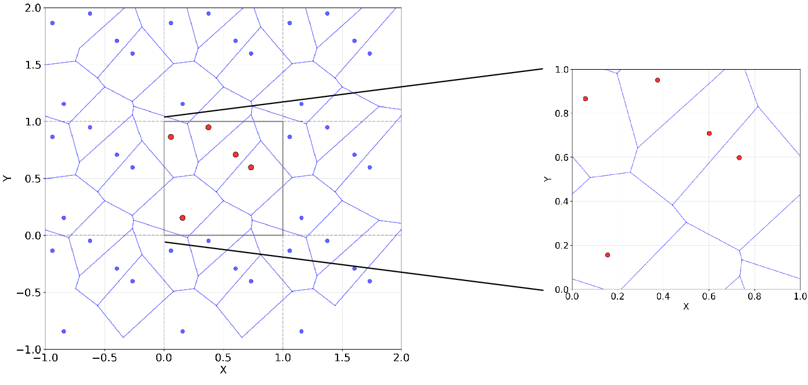

# Supplement: Topologically Diverse (TD) Dataset

```{admonition} Coverage
:class: important
This page annotates **Supplementary information**, source lines **6-73**. The original LaTeX source is reproduced in line-numbered blocks, followed by commentary explaining the role, assumptions, and interpretation of each block.
```

## Reading Lens

- This supplementary section fills in implementation detail or additional evidence that the main text compresses.
- Read it as support for reproducibility: generation procedures, additional RTPxyz results, and fold-level performance tables.
- Where the main text states a result, the supplement often exposes the variation or construction detail behind it.

## Annotated Source

### Topologically Diverse (TD) Dataset

::::{admonition} Source lines 6-6
:class: note

```latex
   6 | \section{Topologically Diverse (TD) Dataset}
```

**Readable text**

> Topologically Diverse (TD) Dataset

**Commentary and remarks**

- This heading opens a new logical unit: **Topologically Diverse (TD) Dataset**.
- Use it as a checkpoint: the paper is changing either scale, object, method, or evidential role.
- This broadens the study beyond RTP by adding structurally diverse families that test whether the descriptor idea generalizes.
- In the dataset section, this block defines the experimental material on which all later descriptor comparisons depend.
::::

::::{admonition} Source lines 7-8
:class: note

```latex
   7 | The RTP dataset is described in detail in the main text. All porous structures used in this study—including the RTP, TD, and ATTD datasets—are openly available in the dedicated repository associated with this paper: \url{https://github.com/dioscuri-tda/direction-aware-tda-for-porous-materials}. 
   8 | The repository also provides a utility for converting the voxelized data into VTK format, enabling straightforward visualization and rendering using standard tools such as ParaView.
```

**Readable text**

> The RTP dataset is described in detail in the main text. All porous structures used in this study—including the RTP, TD, and ATTD datasets—are openly available in the dedicated repository associated with this paper: https://github.com/dioscuri-tda/direction-aware-tda-for-porous-materials. The repository also provides a utility for converting the voxelized data into VTK format, enabling straightforward visualization and rendering using standard tools such as ParaView.

**Commentary and remarks**

- This keeps the physical object in view: porous solid/void geometry is the structure whose topology and mechanics are being related.
- This introduces or uses TDA as a multiscale language for connectivity, loops, cavities, and Euler-characteristic summaries.
- This is central to the paper: the loading direction must survive the descriptor construction because the material response is axis-dependent.
- This defines the RTP construction, where anisotropy is controlled in Fourier space before thresholding into a porous structure.
- This broadens the study beyond RTP by adding structurally diverse families that test whether the descriptor idea generalizes.
::::

#### Generation of porous structures

::::{admonition} Source lines 10-10
:class: note

```latex
  10 | \subsection{Generation of porous structures}
```

**Readable text**

> Generation of porous structures

**Commentary and remarks**

- This heading opens a new logical unit: **Generation of porous structures**.
- Use it as a checkpoint: the paper is changing either scale, object, method, or evidential role.
- This keeps the physical object in view: porous solid/void geometry is the structure whose topology and mechanics are being related.
- This broadens the study beyond RTP by adding structurally diverse families that test whether the descriptor idea generalizes.
- In the dataset section, this block defines the experimental material on which all later descriptor comparisons depend.
::::

##### Random Voronoi structuresapp:voronois

::::{admonition} Source lines 11-11
:class: note

```latex
  11 | \subsubsection{Random Voronoi structures}\label{app:voronois}
```

**Readable text**

> Random Voronoi structures (label: app:voronois)

**Commentary and remarks**

- This heading opens a new logical unit: **Random Voronoi structuresapp:voronois**.
- Use it as a checkpoint: the paper is changing either scale, object, method, or evidential role.
- This broadens the study beyond RTP by adding structurally diverse families that test whether the descriptor idea generalizes.
- In the dataset section, this block defines the experimental material on which all later descriptor comparisons depend.
::::

::::{admonition} Source lines 13-13
:class: note

```latex
  13 | 600 random Voronoi structures were generated. For each structure, between 3 and 12 points were sampled from a unit cell (randomly, uniform distribution), with the space between them tesselated into Voronoi regions and the edges between regions used as a skeleton for the structure. The voxels traversed by the edges are approximated using the Bresenham's Line Algorithm~\cite{bresenham1965algorithm} and included within the structure. The edges are thickened to form struts with a square-shaped cross-section, with the side length of the square randomly drawn from the uniform distribution between 0.06 and 0.14. In order to guarantee periodicity of the structure, copies of the original points are generated in cells neighbouring the unit cell as well and the Voronoi tesselation of space, voxelisation of edges and subsequent thickening is conducted within the neighbouring cells as well (see Fig. \ref{fig:voronoi} for a visualization of a 2D version of the procedure), with the neighboring cells discarded at the last stage of the procedure. 
```

**Readable text**

> 600 random Voronoi structures were generated. For each structure, between 3 and 12 points were sampled from a unit cell (randomly, uniform distribution), with the space between them tesselated into Voronoi regions and the edges between regions used as a skeleton for the structure. The voxels traversed by the edges are approximated using the Bresenham's Line Algorithm (citation: bresenham1965algorithm) and included within the structure. The edges are thickened to form struts with a square-shaped cross-section, with the side length of the square randomly drawn from the uniform distribution between 0.06 and 0.14. In order to guarantee periodicity of the structure, copies of the original points are generated in cells neighbouring the unit cell as well and the Voronoi tesselation of space, voxelisation of edges and subsequent thickening is conducted within the neighbouring cells as well (see Fig. (ref: fig:voronoi) for a visualization of a 2D version of the procedure), with the neighboring cells discarded at the last stage of the procedure.

**Commentary and remarks**

- This keeps the physical object in view: porous solid/void geometry is the structure whose topology and mechanics are being related.
- This broadens the study beyond RTP by adding structurally diverse families that test whether the descriptor idea generalizes.
- In the dataset section, this block defines the experimental material on which all later descriptor comparisons depend.
::::

::::{admonition} Source lines 15-20
:class: note

```latex
  15 | \begin{figure}[h!]
  16 |     \centering
  17 |     \includegraphics[width=0.89\linewidth]{Voronoi.png}
  18 |     \caption{A 2D visualisation of the algorithm for generating random Voronoi structures satisfying periodic boundary conditions.}
  19 |     \label{fig:voronoi}
  20 | \end{figure}
```

**Readable text**

> A 2D visualisation of the algorithm for generating random Voronoi structures satisfying periodic boundary conditions.

**Figure assets carried into the book**



**Commentary and remarks**

- This figure is evidential, not decorative: it gives visual grounding for the structures, descriptors, or performance pattern discussed around it.
- Read the caption carefully because it usually encodes the variables and comparisons that make the visual scientifically meaningful.
- This broadens the study beyond RTP by adding structurally diverse families that test whether the descriptor idea generalizes.
- In the dataset section, this block defines the experimental material on which all later descriptor comparisons depend.
::::

##### Zeolitessec:zeolites

::::{admonition} Source lines 22-22
:class: note

```latex
  22 | \subsubsection{Zeolites}\label{sec:zeolites}
```

**Readable text**

> Zeolites (label: sec:zeolites)

**Commentary and remarks**

- This heading opens a new logical unit: **Zeolitessec:zeolites**.
- Use it as a checkpoint: the paper is changing either scale, object, method, or evidential role.
- This broadens the study beyond RTP by adding structurally diverse families that test whether the descriptor idea generalizes.
- In the dataset section, this block defines the experimental material on which all later descriptor comparisons depend.
::::

::::{admonition} Source lines 24-25
:class: note

```latex
  24 | More than 3000 predicted zeolitic structures were recovered from Michael Deem's database~\cite{C0CP02255A, deem2023pcod}. Each structure is described by the basis cell vector and the locations of Si and O atoms in a unit cell. We restricted the studies to structures with a perpendicular shape of the unit cell, which still left over 1500 structures. We transformed the structures from perpendicular to the normalized $1\times1\times1$ cubic volume by stretching/compression. We thickened the edges by dilation to form struts with a square-shaped cross-section of side length 0.12. We used 300 randomly drawn structures from the dataset and connected the locations of the Si atoms in these structures after the stretching/compression to the locations of their nearest Si neighbors (O atoms were not used in the structure). The connections formed the skeleton of the structure. Periodic boundary conditions were guaranteed by a procedure similar to the one used for random Voronoi structures, involving generating copies of the original Si atom locations in cells neighbouring the unit cell and connecting them to their nearest neighbours as well. Another 299 structures were created on the basis of different randomly drawn structures from using Michael Deem's database~\cite{C0CP02255A, deem2023pcod} using the same algorithm, but with using 0.04 instead of 0.12 as the side length of the square-shaped cross-section of the struts.  
  25 | This gives a total of 580 zeolite structures.  %599
```

**Readable text**

> More than 3000 predicted zeolitic structures were recovered from Michael Deem's database (citation: C0CP02255A, deem2023pcod). Each structure is described by the basis cell vector and the locations of Si and O atoms in a unit cell. We restricted the studies to structures with a perpendicular shape of the unit cell, which still left over 1500 structures. We transformed the structures from perpendicular to the normalized $1x1x1$ cubic volume by stretching/compression. We thickened the edges by dilation to form struts with a square-shaped cross-section of side length 0.12. We used 300 randomly drawn structures from the dataset and connected the locations of the Si atoms in these structures after the stretching/compression to the locations of their nearest Si neighbors (O atoms were not used in the structure). The connections formed the skeleton of the structure. Periodic boundary conditions were guaranteed by a procedure similar to the one used for random Voronoi structures, involving generating copies of the original Si atom locations in cells neighbouring the unit cell and connecting them to their nearest neighbours as well. Another 299 structures were created on the basis of different randomly drawn structures from using Michael Deem's database (citation: C0CP02255A, deem2023pcod) using the same algorithm, but with using 0.04 instead of 0.12 as the side length of the square-shaped cross-section of the struts. This gives a total of 580 zeolite structures.

**Commentary and remarks**

- This connects geometry to the target variable: directional Young's modulus under a specified loading axis.
- This broadens the study beyond RTP by adding structurally diverse families that test whether the descriptor idea generalizes.
- This constructs anisotropy by transforming otherwise diverse structures, giving a bridge between controlled RTP anisotropy and heterogeneous real-looking morphologies.
- In the dataset section, this block defines the experimental material on which all later descriptor comparisons depend.
::::

##### Diamond structures

::::{admonition} Source lines 27-27
:class: note

```latex
  27 | \subsubsection{Diamond structures}
```

**Readable text**

> Diamond structures

**Commentary and remarks**

- This heading opens a new logical unit: **Diamond structures**.
- Use it as a checkpoint: the paper is changing either scale, object, method, or evidential role.
- This broadens the study beyond RTP by adding structurally diverse families that test whether the descriptor idea generalizes.
- In the dataset section, this block defines the experimental material on which all later descriptor comparisons depend.
::::

::::{admonition} Source lines 29-29
:class: note

```latex
  29 | 299 diamond-resembling structures were generated. Each structure was generated by creating within the unit cell 8 vertices corresponding to atoms in a diamond lattice and creating between the vertices edges corresponding to bonds between the atoms. The precise locations of the vertices were determined by adding a stochastic displacement to the location of the corresponding atom in the diamond lattice. Each of the three-dimensional components of the stochastic displacement for all vertices in a given lattice were drawn from a normal distribution with a standard deviation $\epsilon$ itself drawn from a uniform distribution between 0 and 0.1 (compare to 1.0 being the length of the side of a unit cell). That way, the amount of stochasticity was varied between the structures. The edges connecting the vertices were thickened via dilation to form struts with square-shaped cross-sections, with the length of the side of the cross-section drawn from a uniform distribution between 0.06 and 0.26. That way, the volume fraction was varied between structures.
```

**Readable text**

> 299 diamond-resembling structures were generated. Each structure was generated by creating within the unit cell 8 vertices corresponding to atoms in a diamond lattice and creating between the vertices edges corresponding to bonds between the atoms. The precise locations of the vertices were determined by adding a stochastic displacement to the location of the corresponding atom in the diamond lattice. Each of the three-dimensional components of the stochastic displacement for all vertices in a given lattice were drawn from a normal distribution with a standard deviation $$ itself drawn from a uniform distribution between 0 and 0.1 (compare to 1.0 being the length of the side of a unit cell). That way, the amount of stochasticity was varied between the structures. The edges connecting the vertices were thickened via dilation to form struts with square-shaped cross-sections, with the length of the side of the cross-section drawn from a uniform distribution between 0.06 and 0.26. That way, the volume fraction was varied between structures.

**Commentary and remarks**

- This broadens the study beyond RTP by adding structurally diverse families that test whether the descriptor idea generalizes.
- In the dataset section, this block defines the experimental material on which all later descriptor comparisons depend.
::::

##### Cubic structures

::::{admonition} Source lines 31-31
:class: note

```latex
  31 | \subsubsection{Cubic structures}
```

**Readable text**

> Cubic structures

**Commentary and remarks**

- This heading opens a new logical unit: **Cubic structures**.
- Use it as a checkpoint: the paper is changing either scale, object, method, or evidential role.
- This broadens the study beyond RTP by adding structurally diverse families that test whether the descriptor idea generalizes.
- In the dataset section, this block defines the experimental material on which all later descriptor comparisons depend.
::::

::::{admonition} Source lines 33-40
:class: note

```latex
  33 | 300 structures resembling a simple cubic strut were generated using the procedure used for diamond structures, with the only difference the 8 initiating points are not the locations of atoms in a diamond structures like in the former dataset, but instead the following set of points: [0, 0, 0],
  34 |         [0.5, 0, 0],
  35 |         [0, 0.5, 0],
  36 |         [0, 0, 0.5],
  37 |         [0, 0.5, 0.5],
  38 |         [0.5, 0, 0.5],
  39 |         [0.5, 0.5, 0],
  40 |         [0.5, 0.5, 0.5]. Replicating further steps from the procedure used to generate the diamond-like structures leads to structures resembling a classical cubic strut, with varying thicknesses of the struts and levels of randomization in locations of the struts' vertices. 
```

**Readable text**

> 300 structures resembling a simple cubic strut were generated using the procedure used for diamond structures, with the only difference the 8 initiating points are not the locations of atoms in a diamond structures like in the former dataset, but instead the following set of points: [0, 0, 0], [0.5, 0, 0], [0, 0.5, 0], [0, 0, 0.5], [0, 0.5, 0.5], [0.5, 0, 0.5], [0.5, 0.5, 0], [0.5, 0.5, 0.5]. Replicating further steps from the procedure used to generate the diamond-like structures leads to structures resembling a classical cubic strut, with varying thicknesses of the struts and levels of randomization in locations of the struts' vertices.

**Commentary and remarks**

- This broadens the study beyond RTP by adding structurally diverse families that test whether the descriptor idea generalizes.
- In the dataset section, this block defines the experimental material on which all later descriptor comparisons depend.
::::

##### Splines

::::{admonition} Source lines 43-43
:class: note

```latex
  43 | \subsubsection{Splines}
```

**Readable text**

> Splines

**Commentary and remarks**

- This heading opens a new logical unit: **Splines**.
- Use it as a checkpoint: the paper is changing either scale, object, method, or evidential role.
- This broadens the study beyond RTP by adding structurally diverse families that test whether the descriptor idea generalizes.
- In the dataset section, this block defines the experimental material on which all later descriptor comparisons depend.
::::

::::{admonition} Source lines 45-46
:class: note

```latex
  45 | To generate a family of smooth porous morphologies, we construct a random \emph{periodic} scalar field on the unit cell and then threshold it.
  46 | Let $n=\texttt{sampling}$ be the number of spline control points per direction and draw i.i.d.\ coefficients
```

**Readable text**

> To generate a family of smooth porous morphologies, we construct a random periodic scalar field on the unit cell and then threshold it. Let $n=`sampling`$ be the number of spline control points per direction and draw i.i.d.\ coefficients

**Commentary and remarks**

- This keeps the physical object in view: porous solid/void geometry is the structure whose topology and mechanics are being related.
- This is central to the paper: the loading direction must survive the descriptor construction because the material response is axis-dependent.
- This explains how continuous fields become admissible binary materials and why connectivity/percolation filters are needed for mechanical tests.
- This broadens the study beyond RTP by adding structurally diverse families that test whether the descriptor idea generalizes.
- In the dataset section, this block defines the experimental material on which all later descriptor comparisons depend.
::::

::::{admonition} Source lines 47-49
:class: note

```latex
  47 | \begin{equation}
  48 | r_{ijk}\sim\mathcal U(0,1),\qquad i,j,k=1,\dots,n .
  49 | \end{equation}
```

**Commentary and remarks**

- This mathematical block defines part of the computational object used later in the pipeline.
- Track the variables here: later descriptors and model inputs inherit these definitions.
- This broadens the study beyond RTP by adding structurally diverse families that test whether the descriptor idea generalizes.
- In the dataset section, this block defines the experimental material on which all later descriptor comparisons depend.
::::

::::{admonition} Source lines 50-52
:class: note

```latex
  50 | In \textsc{Mathematica}, the command
  51 | \texttt{BSplineFunction} builds a trivariate tensor-product B-spline field
  52 | (with \texttt{SplineDegree->3}, \texttt{SplineClosed->True}, \texttt{SplineKnots->"Unclamped"}), i.e.
```

**Readable text**

> In Mathematica, the command `BSplineFunction` builds a trivariate tensor-product B-spline field (with `SplineDegree->3`, `SplineClosed->True`, `SplineKnots->"Unclamped"`), i.e.

**Commentary and remarks**

- This broadens the study beyond RTP by adding structurally diverse families that test whether the descriptor idea generalizes.
- In the dataset section, this block defines the experimental material on which all later descriptor comparisons depend.
::::

::::{admonition} Source lines 53-57
:class: note

```latex
  53 | \begin{equation}
  54 | f(x,y,z)=\sum_{i=1}^{n}\sum_{j=1}^{n}\sum_{k=1}^{n}
  55 | r_{ijk}\,N_{i,3}(x)\,N_{j,3}(y)\,N_{k,3}(z),
  56 | \label{eq:spline_field}
  57 | \end{equation}
```

**Commentary and remarks**

- This mathematical block defines part of the computational object used later in the pipeline.
- Track the variables here: later descriptors and model inputs inherit these definitions.
- This broadens the study beyond RTP by adding structurally diverse families that test whether the descriptor idea generalizes.
- In the dataset section, this block defines the experimental material on which all later descriptor comparisons depend.
::::

::::{admonition} Source lines 58-58
:class: note

```latex
  58 | where $\{N_{i,3}\}$ are cubic B-spline basis functions (defined via the Cox--de Boor recursion), and the ``closed'' setting enforces periodicity across the cell boundaries \cite{deBoor1978,wolframBSplineFunction}.
```

**Readable text**

> where $\N_i,3\$ are cubic B-spline basis functions (defined via the Cox--de Boor recursion), and the ``closed'' setting enforces periodicity across the cell boundaries (citation: deBoor1978,wolframBSplineFunction).

**Commentary and remarks**

- This broadens the study beyond RTP by adding structurally diverse families that test whether the descriptor idea generalizes.
- In the dataset section, this block defines the experimental material on which all later descriptor comparisons depend.
::::

::::{admonition} Source lines 60-61
:class: note

```latex
  60 | A binary structure is then obtained as a super-level set. Using wrapped (periodic) coordinates
  61 | $\tilde{\boldsymbol{x}}=(x\bmod 1,\,y\bmod 1,\,z\bmod 1)$ (implemented with \texttt{Mod}), we voxelize on an $L\times L\times L$ grid (here $L=80$) by
```

**Readable text**

> A binary structure is then obtained as a super-level set. Using wrapped (periodic) coordinates $x=(x 1, y 1, z 1)$ (implemented with `Mod`), we voxelize on an $Lx Lx L$ grid (here $L=80$) by

**Commentary and remarks**

- This keeps the physical object in view: porous solid/void geometry is the structure whose topology and mechanics are being related.
- This explains how continuous fields become admissible binary materials and why connectivity/percolation filters are needed for mechanical tests.
- This broadens the study beyond RTP by adding structurally diverse families that test whether the descriptor idea generalizes.
- In the dataset section, this block defines the experimental material on which all later descriptor comparisons depend.
::::

::::{admonition} Source lines 62-66
:class: note

```latex
  62 | \begin{equation}
  63 | T_{abc}(t)=\mathbf{1}\Bigl\{\,f\!\bigl(\tfrac{a}{L},\tfrac{b}{L},\tfrac{c}{L}\bigr)\ge t\,\Bigr\},
  64 | \qquad a,b,c=0,\dots,L-1,
  65 | \label{eq:thresholding}
  66 | \end{equation}
```

**Commentary and remarks**

- This mathematical block defines part of the computational object used later in the pipeline.
- Track the variables here: later descriptors and model inputs inherit these definitions.
- This explains how continuous fields become admissible binary materials and why connectivity/percolation filters are needed for mechanical tests.
- This broadens the study beyond RTP by adding structurally diverse families that test whether the descriptor idea generalizes.
- In the dataset section, this block defines the experimental material on which all later descriptor comparisons depend.
::::

::::{admonition} Source lines 67-67
:class: note

```latex
  67 | and report the volume fraction
```

**Readable text**

> and report the volume fraction

**Commentary and remarks**

- This broadens the study beyond RTP by adding structurally diverse families that test whether the descriptor idea generalizes.
- In the dataset section, this block defines the experimental material on which all later descriptor comparisons depend.
::::

::::{admonition} Source lines 68-70
:class: note

```latex
  68 | \begin{equation}
  69 | \phi(t)=\frac{1}{L^{3}}\sum_{a,b,c} T_{abc}(t).
  70 | \end{equation}
```

**Commentary and remarks**

- This mathematical block defines part of the computational object used later in the pipeline.
- Track the variables here: later descriptors and model inputs inherit these definitions.
- This broadens the study beyond RTP by adding structurally diverse families that test whether the descriptor idea generalizes.
- In the dataset section, this block defines the experimental material on which all later descriptor comparisons depend.
::::

::::{admonition} Source lines 71-72
:class: note

```latex
  71 | Varying the threshold $t$ (in our implementation, on an approximately uniform grid in $[0.35,0.50]$) produces two independent subsets of spline-based structures each, spanning a range of $\phi(t)$ while preserving smoothness and periodic tiling of the unit cell.
  72 | Total of 596 spline structures were used in the dataset.
```

**Readable text**

> Varying the threshold $t$ (in our implementation, on an approximately uniform grid in $[0.35,0.50]$) produces two independent subsets of spline-based structures each, spanning a range of $phi(t)$ while preserving smoothness and periodic tiling of the unit cell. Total of 596 spline structures were used in the dataset.

**Commentary and remarks**

- This explains how continuous fields become admissible binary materials and why connectivity/percolation filters are needed for mechanical tests.
- This broadens the study beyond RTP by adding structurally diverse families that test whether the descriptor idea generalizes.
- In the dataset section, this block defines the experimental material on which all later descriptor comparisons depend.
::::

