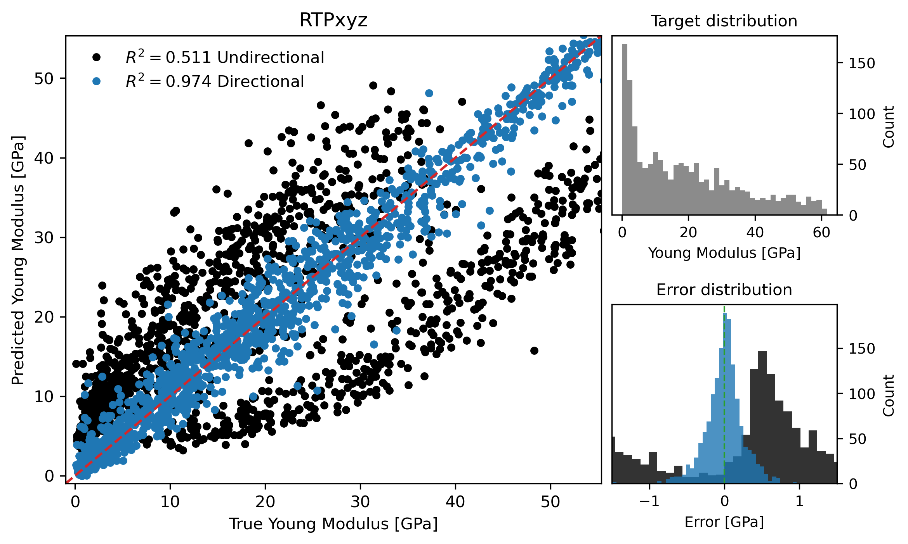

# Supplement: Results for RTPxyz dataset

```{admonition} Coverage
:class: annotation-legend
This page annotates **Supplementary information**, source lines **74-104**. Blue blocks reproduce or faithfully restate the original source material. Amber blocks are model-added interpretation explaining role, assumptions, and reading context.
```

```{admonition} Reading lens
:class: model-interpretation
- This section is the empirical test of the paper's thesis. Read every reported score as a comparison between direction-agnostic topology, direction-aware topology, and voxel CNN baselines.
- The important pattern is not a single best number but the relationship between anisotropy and the gain from direction-aware descriptors.
- Use the tables and figures to distinguish strong-anisotropy wins, weak-anisotropy parity, and cases where descriptor families behave differently.
```

## Annotated Source

### Results for RTPxyz dataset

::::{admonition} Original paper material - source lines 74-74
:class: paper-original

```latex
  74 | \section{Results for RTPxyz dataset}
```

**Readable text**

> Results for RTPxyz dataset

::::

::::{admonition} Model-added interpretation - source lines 74-74
:class: model-interpretation

- This heading opens a new logical unit: **Results for RTPxyz dataset**.
- Use it as a checkpoint: the paper is changing either scale, object, method, or evidential role.
- This defines the RTP construction, where anisotropy is controlled in Fourier space before thresholding into a porous structure.
- In the dataset section, this block defines the experimental material on which all later descriptor comparisons depend.
::::

::::{admonition} Original paper material - source lines 75-80
:class: paper-original

```latex
  75 | \begin{figure}
  76 |     \centering
  77 |     \includegraphics[width=0.75\textwidth]{scatter_rtp_xyz.png}
  78 |     \caption{Predicted versus FFTMAD-computed Young’s modulus for the RTPxyz dataset. The same as Figure 4 in the Manuscript but for the RTPxyz dataset. }
  79 |     \label{fig:scatter_rtp_xyz}
  80 | \end{figure} 
```

**Readable text**

> Predicted versus FFTMAD-computed Young’s modulus for the RTPxyz dataset. The same as Figure 4 in the Manuscript but for the RTPxyz dataset.

**Figure assets carried into the book**



::::

::::{admonition} Model-added interpretation - source lines 75-80
:class: model-interpretation

- This figure is evidential, not decorative: it gives visual grounding for the structures, descriptors, or performance pattern discussed around it.
- Read the caption carefully because it usually encodes the variables and comparisons that make the visual scientifically meaningful.
- This connects geometry to the target variable: directional Young's modulus under a specified loading axis.
- This defines the RTP construction, where anisotropy is controlled in Fourier space before thresholding into a porous structure.
- This is the target-generation mechanism: the paper uses FFT-based homogenization rather than treating stiffness labels as empirical annotations.
::::

::::{admonition} Original paper material - source lines 82-82
:class: paper-original

```latex
  82 | Models were additionally trained on the RTPxyz dataset, which aggregates Young’s modulus values computed for the RTP structures along all three Cartesian directions. This dataset comprises a total of 1500 samples, of which two thirds correspond to the mechanically easy axes ($x$ and $y$) and one third to the mechanically hard axis ($z$). The scatter plot of predicted versus FFTMAD-computed Young’s modulus for models trained with directional and non-directional descriptors is shown in Fig.~\ref{fig:scatter_rtp_xyz}, while the corresponding regression metrics are summarized in Table~\ref{tab:metrics_rtp_xyz}.
```

**Readable text**

> Models were additionally trained on the RTPxyz dataset, which aggregates Young’s modulus values computed for the RTP structures along all three Cartesian directions. This dataset comprises a total of 1500 samples, of which two thirds correspond to the mechanically easy axes ($x$ and $y$) and one third to the mechanically hard axis ($z$). The scatter plot of predicted versus FFTMAD-computed Young’s modulus for models trained with directional and non-directional descriptors is shown in Fig. (ref: fig:scatter_rtp_xyz), while the corresponding regression metrics are summarized in Table (ref: tab:metrics_rtp_xyz).

::::

::::{admonition} Model-added interpretation - source lines 82-82
:class: model-interpretation

- This connects geometry to the target variable: directional Young's modulus under a specified loading axis.
- This is central to the paper: the loading direction must survive the descriptor construction because the material response is axis-dependent.
- This defines the RTP construction, where anisotropy is controlled in Fourier space before thresholding into a porous structure.
- This is the target-generation mechanism: the paper uses FFT-based homogenization rather than treating stiffness labels as empirical annotations.
- In the dataset section, this block defines the experimental material on which all later descriptor comparisons depend.
::::

::::{admonition} Original paper material - source lines 84-84
:class: paper-original

```latex
  84 | Models based on directional descriptors maintain high predictive accuracy, with predictions tightly clustered around the diagonal and a coefficient of determination of $R^2 = 0.974$. In contrast, models relying on non-directional descriptors perform poorly, achieving only $R^2 = 0.511$. The corresponding scatter plot reveals a pronounced bifurcation: predictions obtained from non-directional descriptors split into two distinct branches, one above and one below the diagonal.
```

**Readable text**

> Models based on directional descriptors maintain high predictive accuracy, with predictions tightly clustered around the diagonal and a coefficient of determination of $R^2 = 0.974$. In contrast, models relying on non-directional descriptors perform poorly, achieving only $R^2 = 0.511$. The corresponding scatter plot reveals a pronounced bifurcation: predictions obtained from non-directional descriptors split into two distinct branches, one above and one below the diagonal.

::::

::::{admonition} Model-added interpretation - source lines 84-84
:class: model-interpretation

- This is central to the paper: the loading direction must survive the descriptor construction because the material response is axis-dependent.
- This defines the RTP construction, where anisotropy is controlled in Fourier space before thresholding into a porous structure.
- This is a performance-interpretation block. Watch both $R^2$ and MAE because they answer different questions about explained variance and absolute error.
- In the dataset section, this block defines the experimental material on which all later descriptor comparisons depend.
::::

::::{admonition} Original paper material - source lines 86-98
:class: paper-original

```latex
  86 | \begin{table}[]
  87 | \centering
  88 | \caption{Cross-validated regression metrics for Young’s modulus prediction using CatBoost with PH, ECP, and PH+ECP topological summaries, and a CNN baseline trained directly on voxelized structures. Reported as average over 8 folds. The same as Table~1 in the manuscript but for the RTPxyz dataset.}
  89 | \label{tab:metrics_rtp_xyz}
  90 | \begin{tabular}{lcc|cc||l|rrrr}
  91 | \hline 
  92 |  & \multicolumn{2}{l}{} & \multicolumn{2}{|l||}{CNN baseline} &  & \multicolumn{2}{l}{Non-directional} & \multicolumn{2}{l}{Directional} \\
  93 | Dataset & $\sigma(k)$ & $\sigma(L)$ & $R^2$ & MAE & Method & $R^2$ & MAE & $R^2$ & MAE \\ \hline
  94 | RTPxyz & 0.38 & 1.77 & 0.990 & 1.88 & PH     & 0.509 & 13.26 & 0.548 & 13.61 \\
  95 |  &  &  &  &                        & ECP    & 0.493 & 15.11 & 0.974 & 3.09 \\
  96 |  &  &  &  &                        & PH+ECP & 0.511 & 9.94  & 0.974 & 2.89 \\ \hline
  97 | \end{tabular}
  98 | \end{table}
```

**Readable text**

> Cross-validated regression metrics for Young’s modulus prediction using CatBoost with PH, ECP, and PH+ECP topological summaries, and a CNN baseline trained directly on voxelized structures. Reported as average over 8 folds. The same as Table~1 in the manuscript but for the RTPxyz dataset.

::::

::::{admonition} Model-added interpretation - source lines 86-98
:class: model-interpretation

- This table is a quantitative claim surface. Compare rows by dataset, descriptor family, directional status, and error metric rather than reading only the best score.
- The main inferential question is whether directional information improves prediction under the same learning setup.
- This keeps the physical object in view: porous solid/void geometry is the structure whose topology and mechanics are being related.
- This connects geometry to the target variable: directional Young's modulus under a specified loading axis.
- This is central to the paper: the loading direction must survive the descriptor construction because the material response is axis-dependent.
::::

::::{admonition} Original paper material - source lines 101-101
:class: paper-original

```latex
 101 | The upper branch (systematic overestimation) predominantly contains data points corresponding to compression along the mechanically easy $x$ and $y$ axes, where the true Young’s modulus is relatively low. The lower branch (systematic underestimation) consists mainly of samples compressed along the mechanically hard $z$ axis, where the true Young’s modulus is significantly higher. This clear separation demonstrates that non-directional descriptors fail to encode the loading direction and therefore cannot distinguish between mechanically inequivalent orientations of the same structure.
```

**Readable text**

> The upper branch (systematic overestimation) predominantly contains data points corresponding to compression along the mechanically easy $x$ and $y$ axes, where the true Young’s modulus is relatively low. The lower branch (systematic underestimation) consists mainly of samples compressed along the mechanically hard $z$ axis, where the true Young’s modulus is significantly higher. This clear separation demonstrates that non-directional descriptors fail to encode the loading direction and therefore cannot distinguish between mechanically inequivalent orientations of the same structure.

::::

::::{admonition} Model-added interpretation - source lines 101-101
:class: model-interpretation

- This connects geometry to the target variable: directional Young's modulus under a specified loading axis.
- This is central to the paper: the loading direction must survive the descriptor construction because the material response is axis-dependent.
- This defines the RTP construction, where anisotropy is controlled in Fourier space before thresholding into a porous structure.
- In the dataset section, this block defines the experimental material on which all later descriptor comparisons depend.
::::

::::{admonition} Original paper material - source lines 103-103
:class: paper-original

```latex
 103 | Only a small fraction of predictions obtained with non-directional descriptors lie close to the line of perfect agreement, which is reflected in the broadened and multimodal error distribution shown in the inset histogram. In contrast, no such branching behavior is observed for directional descriptors: predictions remain symmetrically distributed around the diagonal, indicating that direction-aware topology provides a consistent and physically meaningful representation of anisotropic mechanical response.
```

**Readable text**

> Only a small fraction of predictions obtained with non-directional descriptors lie close to the line of perfect agreement, which is reflected in the broadened and multimodal error distribution shown in the inset histogram. In contrast, no such branching behavior is observed for directional descriptors: predictions remain symmetrically distributed around the diagonal, indicating that direction-aware topology provides a consistent and physically meaningful representation of anisotropic mechanical response.

::::

::::{admonition} Model-added interpretation - source lines 103-103
:class: model-interpretation

- This is central to the paper: the loading direction must survive the descriptor construction because the material response is axis-dependent.
- This defines the RTP construction, where anisotropy is controlled in Fourier space before thresholding into a porous structure.
- In the dataset section, this block defines the experimental material on which all later descriptor comparisons depend.
::::

