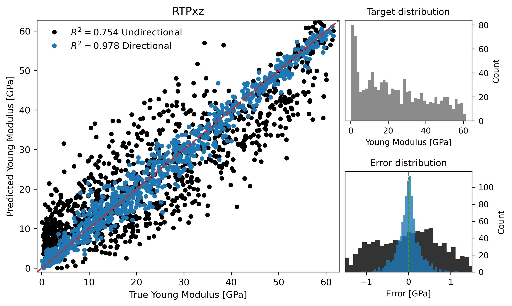

# Results

The headline result is that directional descriptors become increasingly valuable as structural anisotropy increases.

## Main Performance Table

| Dataset | sigma(k) | sigma(L) | CNN R2 | CNN MAE | Method | Non-dir R2 | Non-dir MAE | Dir R2 | Dir MAE |
| --- | ---: | ---: | ---: | ---: | --- | ---: | ---: | ---: | ---: |
| RTPxz | 0.40 | 1.89 | 0.985 | 1.62 | PH | 0.463 | 9.42 | 0.954 | 2.65 |
| RTPxz | 0.40 | 1.89 | 0.985 | 1.62 | ECP | 0.616 | 12.06 | 0.978 | 1.85 |
| RTPxz | 0.40 | 1.89 | 0.985 | 1.62 | PH+ECP | 0.754 | 7.05 | 0.978 | 1.86 |
| RTPxy | 0.11 | 0.21 | 0.979 | 1.02 | PH | 0.878 | 2.42 | 0.873 | 2.45 |
| RTPxy | 0.11 | 0.21 | 0.979 | 1.02 | ECP | 0.925 | 1.86 | 0.940 | 1.66 |
| RTPxy | 0.11 | 0.21 | 0.979 | 1.02 | PH+ECP | 0.916 | 1.98 | 0.938 | 1.69 |
| TD | 0.14 | 1.80 | 0.976 | 0.62 | PH | 0.596 | 2.44 | 0.665 | 2.18 |
| TD | 0.14 | 1.80 | 0.976 | 0.62 | ECP | 0.815 | 1.48 | 0.818 | 1.66 |
| TD | 0.14 | 1.80 | 0.976 | 0.62 | PH+ECP | 0.822 | 1.46 | 0.836 | 1.53 |
| ATTD | 0.20 | 1.74 | 0.894 | 0.34 | PH | 0.536 | 3.78 | 0.759 | 2.53 |
| ATTD | 0.20 | 1.74 | 0.894 | 0.34 | ECP | 0.653 | 3.36 | 0.815 | 2.13 |
| ATTD | 0.20 | 1.74 | 0.894 | 0.34 | PH+ECP | 0.643 | 3.33 | 0.825 | 2.06 |

## Interpretation

### Strong Anisotropy

RTPxz is the clearest test case. The same RTP structures are compressed along an easy axis and a hard axis. Non-directional descriptors lose this distinction. Direction-aware ECP and PH+ECP reach $R^2=0.978$, nearly matching the CNN baseline of $R^2=0.985$.

### Weak Or Nominal Isotropy

RTPxy and TD are weaker tests for direction-aware descriptors because the response is closer to isotropic. Directional descriptors still remain competitive and often improve $R^2$, suggesting that they are not merely a special-purpose anisotropy trick.

### Moderate Anisotropy In Diverse Structures

ATTD is important because it is not generated by the RTP mechanism. Direction-aware descriptors improve substantially after geometric elongation, showing that the mechanism generalizes beyond one synthetic structure family.

## Main Takeaways

1. ECP is the strongest standalone topological descriptor family in the reported table.
2. PH+ECP is usually the most stable combined topological representation.
3. Directional descriptors dominate non-directional descriptors when anisotropy is present.
4. The CNN advantage shrinks as directional topology captures the relevant anisotropic information.
